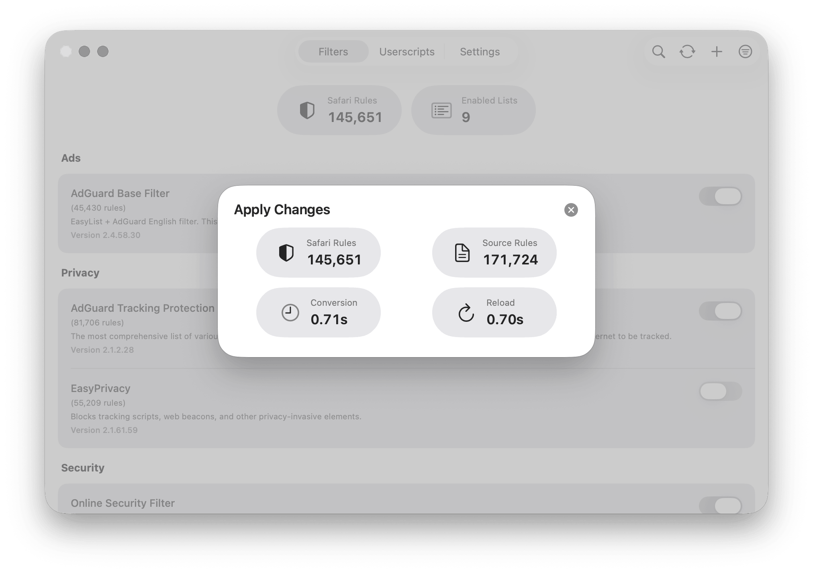
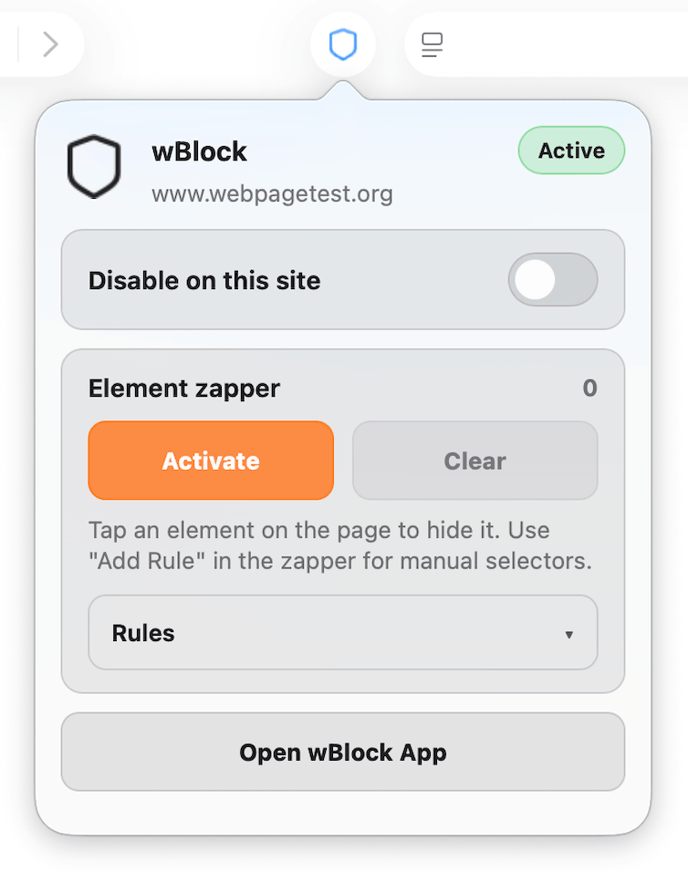
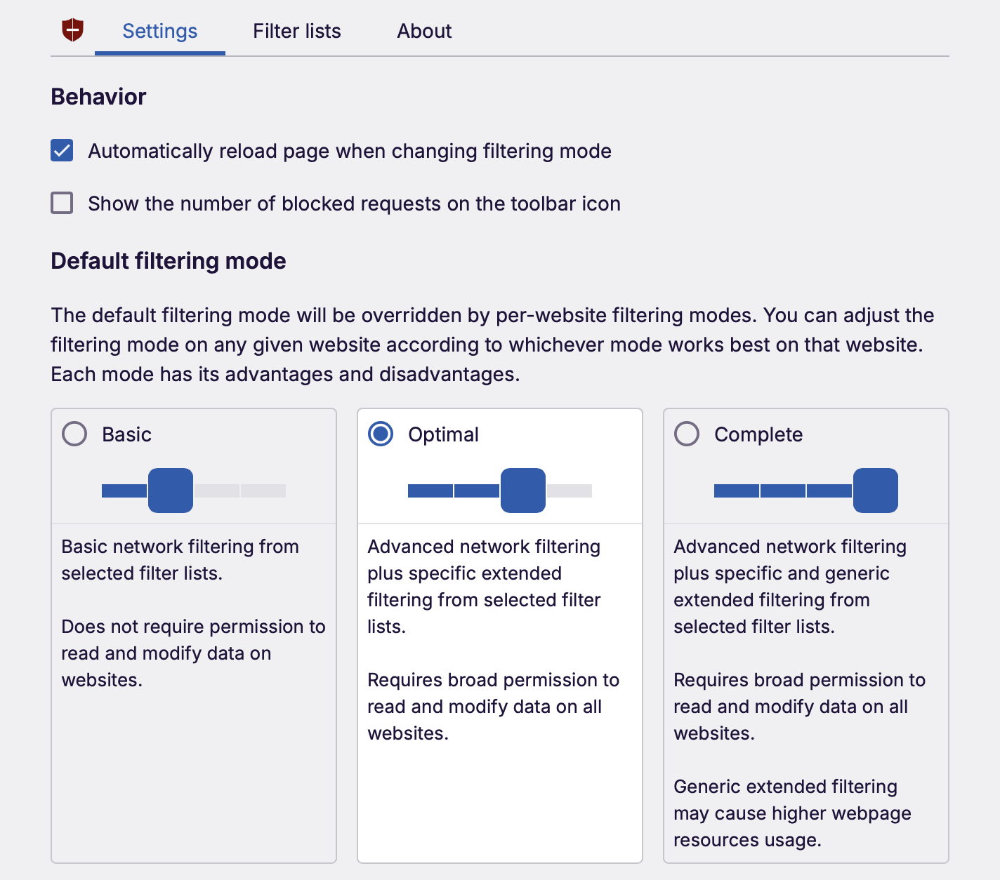
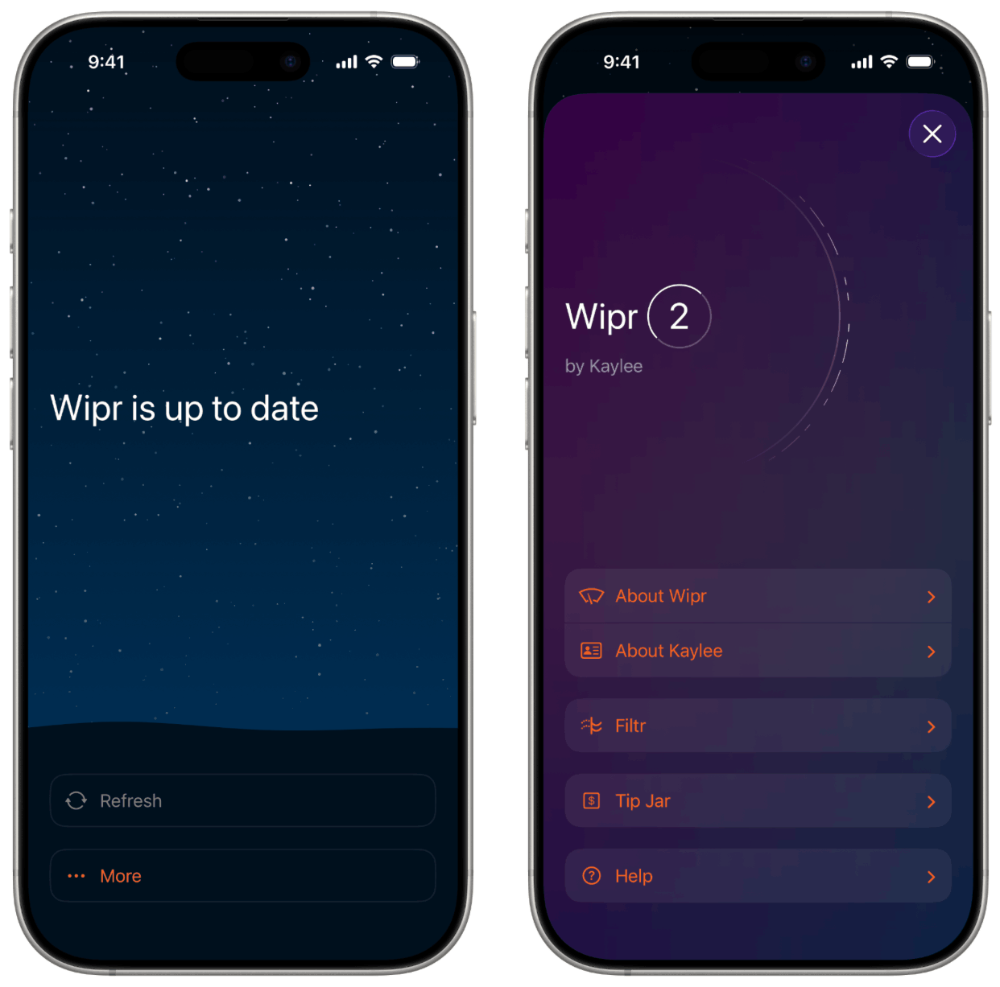
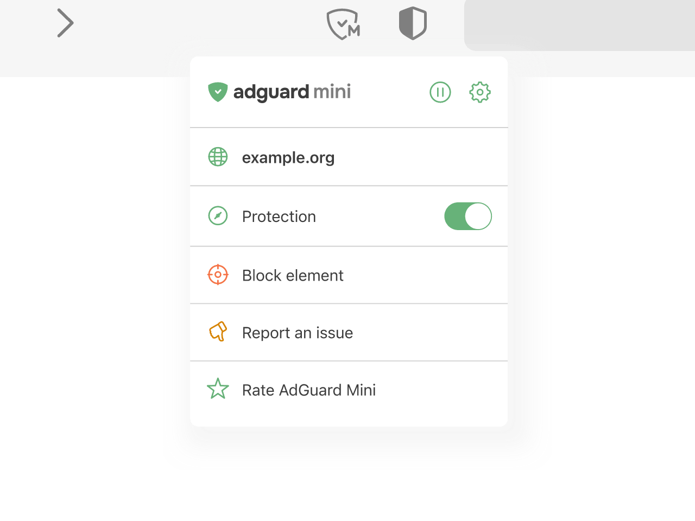

# Safari ad blocker comparison

_Last reviewed: May 20, 2026._

Safari ad blockers are shaped by Apple's extension model. Network blocking is usually handled by compiled content blocker rules, while page-level behavior such as cosmetic filtering, scriptlets, and element picking requires a Safari Web Extension or injected scripts. This comparison focuses on current Safari blockers: wBlock, uBlock Origin Lite, Wipr 2, AdGuard Mini on macOS, and AdGuard for iOS on iPhone and iPad.

The [feature comparison](#feature-comparison) gives a quick checklist. The sections below explain the implementation differences, platform support, update behavior, customization options, and practical limitations behind the table.

## wBlock

wBlock is a native Safari ad blocker for macOS, iOS, and iPadOS. It combines Apple's Content Blocker Extensions for static network filtering with wBlock Scripts for cosmetic filtering, scriptlets, userscripts, and the element zapper. Users enable the bundled Safari extensions, choose filter lists during onboarding, and apply the generated Safari rules.

The app is built with SwiftUI. Static blocking rules are compiled and passed to Safari, so routine network filtering runs through Safari's content blocker engine rather than through a persistent JavaScript request filter. wBlock currently uses five content blocker slots per platform, giving it a total capacity of 750,000 Safari rules. Filter data is stored with Protocol Buffers and LZ4 compression to reduce storage size and keep large enabled-list sets responsive.

<div align="center">
  <picture>
    <source media="(prefers-color-scheme: dark)" srcset="docs/media/img/apply_changes_dark.png" width="700" />
    <source media="(prefers-color-scheme: light)" srcset="docs/media/img/apply_changes_light.png" width="700" />
    
  </picture>
</div>

The main interface reports enabled filter lists, source rule counts, converted Safari rule counts, conversion time, reload time, and affected filter categories. These details are useful because Safari limits each content blocker extension to about 150,000 rules. A blocker that exceeds a slot's capacity has to split, trim, or otherwise manage the rule set. wBlock exposes the conversion result so users can see how many Safari rules were produced and whether a reload is needed.

wBlock Scripts handles features that cannot be expressed as static content blocker rules. Cosmetic filtering hides page elements after load, scriptlets patch common anti-adblock or site-behavior patterns, and the element zapper lets users select page elements visually. The zapper works across macOS, iOS, iPadOS, and visionOS extension contexts. It tracks scroll position and supports parent/child navigation so users can select a container element rather than only the exact clicked node.

<div align="center">
  <picture>
    <source media="(prefers-color-scheme: dark)" srcset="docs/media/img/zapper_dark.png" width="350" />
    <source media="(prefers-color-scheme: light)" srcset="docs/media/img/zapper_light.png" width="350" />
    
  </picture>
</div>

wBlock also includes a userscript engine. Safari does not have the same userscript extension ecosystem as Chrome and Firefox, so wBlock provides its own Greasemonkey-style compatibility layer. Current support includes script storage, resources, menu commands, GM XHR, and both legacy `GM_*` and modern `GM.*` API forms for common operations. Compatibility is still developing, especially for large scripts that depend on less common Tampermonkey APIs, but the feature gives Safari users a built-in path for scripts that would otherwise require a separate userscript manager.

Additional features include iCloud sync for filter selections, custom lists, userscripts, and whitelist; configurable filter auto-updates from hourly to weekly; HTTP conditional requests for efficient filter downloads; preprocessing for AdGuard `!#include` directives; automatic custom filter title detection; Homebrew distribution on macOS; and a macOS blocked-request logger.

wBlock is best suited to users who want native Safari blocking with visible rule conversion, custom lists, userscripts, and debugging tools. The main limitation is project maturity: advanced userscript compatibility is still being expanded, and some site-specific scripts may need fixes before they behave the same way they do in Tampermonkey.

Sources: [wBlock GitHub](https://github.com/0xCUB3/wBlock), [wBlock App Store](https://apps.apple.com/us/app/wblock/id6746388723)

---

## uBlock Origin Lite

uBlock Origin Lite, usually shortened to uBOL, is a separate project from classic uBlock Origin. It is built for Manifest V3 and relies on declarative rules instead of a continuously running request-filtering engine. The browser enforces the compiled rules directly, which reduces background activity but removes or limits several features available in classic uBlock Origin.

On Safari, uBOL is distributed through the App Store for iPhone, iPad, Mac, and Vision Pro. Apple's App Store listing notes that after extension updates, Safari converts updated DNR rulesets into native content blocking rules. This means filtering is efficient once rules are installed, while filter list updates are tied to extension updates rather than to manual in-app list refreshes.

<div align="center">
  
</div>

The popup exposes broad filtering modes such as basic, optimal, and complete. The options page lets users enable additional rulesets. The default ruleset tracks uBlock Origin's default filter selection, including uBO's built-in lists, EasyList, EasyPrivacy, and Peter Lowe's ad and tracking server list.

The main limitation is feature depth compared with classic uBO. uBOL does not provide uBO's dynamic filtering matrix, dynamic URL filtering, per-site no-scripting switch, or full custom filter list workflow. Newer versions include a custom filters pane, mainly for cosmetic filters created through the element picker path, but this is not equivalent to maintaining arbitrary network filter lists. These limits come from the declarative design rather than from a simplified interface alone.

uBOL fits users who want a free, open-source, low-overhead blocker with defaults derived from uBlock Origin. It is less suitable for users who depend on classic uBO's dynamic filtering, extensive custom rules, or manual filter list management. Apple's App Store page states that the developer does not collect data.

Sources: [uBOL GitHub](https://github.com/uBlockOrigin/uBOL-home), [uBOL FAQ](https://github.com/uBlockOrigin/uBOL-home/wiki/Frequently-asked-questions-(FAQ)), [uBOL App Store](https://apps.apple.com/us/app/ublock-origin-lite/id6745342698)

---

## Wipr 2

Wipr 2 is a paid native Safari blocker focused on automatic operation and minimal configuration. Users enable the four Wipr blocklist extensions and Wipr Extra in Safari. The app does not expose filter subscriptions, custom rule editing, request logs, or detailed blocking categories.

<div align="center">
  <picture>
    <source media="(prefers-color-scheme: dark)" srcset="docs/media/img/adblock_comparison/wipr_2_dark.png" width="700" />
    <source media="(prefers-color-scheme: light)" srcset="docs/media/img/adblock_comparison/wipr_2_light.png" width="700" />
    
  </picture>
</div>

The App Store description says Wipr blocks ads, popups, trackers, cookie warnings, and other web annoyances. Its blocklist updates twice a week automatically. Wipr also includes enhanced blocklists for many languages, selected from the device's preferred languages rather than through manual regional-list management. Wipr 2 is sold as a universal purchase for iPhone, iPad, Mac, and Vision Pro, with optional tips as in-app purchases.

Wipr's help page describes a two-part architecture. The main Wipr blocklists use Safari's Content Blocking Extensions API. Wipr Extra uses the Safari Web Extensions API for cases that static rules cannot handle well, including some difficult ads and anti-adblock behavior. Extra is optional because it requires broader website access than static content blockers.

The tradeoff is limited customization. Wipr does not support custom filter lists, a user rule editor, block statistics, a visible request logger, userscripts, or an element zapper. Its design depends on the built-in blocklists and the developer's update schedule. This makes it appropriate for users who want low-maintenance blocking, but not for users who need to inspect, tune, or extend the filtering behavior.

At $4.99, Wipr 2 is the simplest paid option in this comparison. Its strengths are native platform coverage, automatic updates, low configuration burden, and a privacy-focused App Store listing. Its limitations are the absence of power-user controls and reliance on the bundled lists.

Sources: [Wipr 2 App Store](https://apps.apple.com/us/app/wipr-2/id1662217862), [Wipr Help](https://kaylees.site/wipr-help.html)

---

## AdGuard Mini and AdGuard for iOS

AdGuard's Safari blockers are split by platform. AdGuard Mini is the renamed and rebuilt version of AdGuard for Safari for macOS. On iPhone and iPad, the comparable product is AdGuard for iOS. Both are separate from the full AdGuard for Mac app, which is the system-wide macOS option.

<div align="center">
  <picture>
    <source media="(prefers-color-scheme: dark)" srcset="docs/media/img/adblock_comparison/adguard_mini_dark.png" width="700" />
    <source media="(prefers-color-scheme: light)" srcset="docs/media/img/adblock_comparison/adguard_mini_light.png" width="700" />
    
  </picture>
</div>

AdGuard Mini uses Safari's Content Blocking API and splits rules across six content blockers: General, Privacy, Social, Security, Other, and Custom. AdGuard's knowledge base lists the combined capacity as 900,000 filtering rules, with Safari's 150,000-rule limit applying to each content-blocking extension. Actual coverage depends on the enabled filters, conversion output, and distribution across the six rule slots.

Mini provides more direct filter management than Wipr or uBOL. It includes filter categories, custom filters, user rules, element blocking, issue reporting, and an advanced rule editor. The App Store page lists English plus 33 other app languages, and AdGuard's filter ecosystem gives it broad regional and category coverage.

The free version covers core Safari blocking. Pro features require an AdGuard license or in-app purchase and include real-time filter updates, AdGuard Extra for anti-adblock and difficult ads, and advanced custom filters. At the time of writing, version 2.1.4 is current on the App Store, while 2.2.0 is available as a beta on GitHub.

AdGuard for iOS is a separate app for iPhone and iPad. Its Safari protection uses six content blockers: General, Privacy, Social, Security, Custom, and Other. AdGuard's iOS knowledge base says iOS 15 raised the per-content-blocker cap to 150,000 rules, and the app exposes filters, user rules, an allowlist, and custom filter URLs. AdGuard for iOS also includes DNS protection for blocking through DNS servers and DNS filters.

The iOS Safari Web Extension adds browser controls for enabling or disabling protection on the current site, manually blocking page elements, reporting issues, and applying advanced filtering rules and scriptlets. Advanced protection requires Premium. AdGuard also says the separate AdGuard and AdGuard Pro iOS apps are now basically the same, so users do not need both.

AdGuard's Safari products are best suited to users who want a mature filter ecosystem, detailed rule-management tools, and AdGuard's filtering syntax and lists. Mini covers macOS Safari, while AdGuard for iOS covers iPhone and iPad. Users who need system-wide filtering on macOS should compare Mini with the full AdGuard for Mac app rather than with Safari-only blockers alone.

Sources: [AdGuard Mini](https://adguard.com/en/adguard-mini-mac/overview.html), [AdGuard Mini App Store](https://apps.apple.com/pl/app/adguard-mini/id1440147259?mt=12), [AdGuard Mini GitHub](https://github.com/AdguardTeam/AdGuardMiniForMac), [AdGuard rule limit KB](https://adguard.com/kb/adguard-mini-for-mac/solving-problems/rule-limit/), [AdGuard for iOS](https://adguard.com/en/adguard-ios/overview.html), [AdGuard for iOS GitHub](https://github.com/AdguardTeam/AdguardForiOS), [AdGuard iOS Safari protection KB](https://adguard.com/kb/adguard-for-ios/features/safari-protection/), [AdGuard iOS Web Extension KB](https://adguard.com/kb/adguard-for-ios/web-extension/), [AdGuard and AdGuard Pro KB](https://adguard.com/kb/adguard-for-ios/adguard-and-adguard-pro/)

---

# Feature comparison

| **Feature** | **wBlock**<sup>1</sup> | **uBlock Origin Lite**<sup>2</sup> | **Wipr 2**<sup>3</sup> | **AdGuard Mini / iOS**<sup>4</sup> |
|:--|:--:|:--:|:--:|:--:|
| macOS support | ✅ | ✅ | ✅ | ✅ via Mini |
| iOS / iPadOS support | ✅ | ✅ | ✅ | ✅ via AdGuard for iOS<sup>20</sup> |
| visionOS support | ✅ extension pieces | ✅ | ✅ | ❌ |
| RAM usage measured locally | ~40 MB<sup>6</sup> | ~120 MB<sup>6</sup> | ~50 MB<sup>6</sup> | ~100 MB Mini<sup>6</sup> |
| Static rule capacity | 750,000<sup>7</sup> | DNR-based, browser-dependent<sup>7</sup> | 4 blocklist extensions, capacity not published<sup>7</sup> | 900,000 Mini; iOS has six 150k slots<sup>7</sup> |
| GitHub stars (rough popularity signal) | ~2.5k | ~3.3k for uBOL | N/A | ~1.2k Mini / ~1.7k iOS |
| Open source | ✅ | ✅ | ❌ | ✅, license differs by app |
| License | GPL-3.0 | GPL-3.0 | Proprietary | Mini: Other / AdGuard source license; iOS: GPL-3.0 |
| Main implementation | Swift + JS | JavaScript | Swift | Swift + web UI |
| Extension architecture | Content Blocker + Web Extension | MV3 declarative extension | Content Blocker + Web Extension | Content Blocker + Web Extension |
| Filter storage | Protocol Buffers + LZ4 | Packaged DNR rulesets + extension storage | Closed source | App storage + JSON/rules files |
| Element zapper / picker | ✅ | ✅ for cosmetic filters | ❌ | ✅ |
| Custom filter lists | ✅ | ❌ full lists; limited cosmetic custom filters | ❌ | ✅ |
| User rule editor | ✅ | Limited | ❌ | ✅ |
| Dynamic filtering | Limited Safari workaround<sup>12</sup> | ❌ | ❌ | Limited, not uBO-style<sup>12</sup> |
| YouTube ad blocking | ✅ | ✅ / varies by site changes | ✅ via Wipr Extra | ✅, stronger with Pro Extra |
| Script injection / scriptlets | ✅ | Declarative scriptlets | Wipr Extra only | ✅ |
| Userscript support | ✅ | ❌ | ❌ | ❌ in Mini / iOS<sup>15</sup> |
| Filter updates | Automatic, 1h to 7d configurable | Extension updates only | Automatic, twice weekly | Automatic; real-time updates require Pro |
| Multi-device sync | ✅ iCloud | ❌ | ❌ settings sync, universal purchase | ❌ |
| Per-site disable | ✅ | ✅ | ✅ through Safari/Wipr Extra controls | ✅ |
| Whitelist / allowlist | ✅ | ✅ | ✅ | ✅ |
| Logging / debugging | ✅ macOS logger | ❌ | ❌ | ✅ |
| Regional / language filters | ✅, plus manual lists | ✅ rulesets | ✅ 30+ language variants | ✅ 34 app languages and many filters |
| Interface style | Native, detailed | Popup + web options | Native, minimal | Detailed AdGuard apps |
| Cost | Free | Free | $4.99 one-time, optional tips | Free, Pro subscription / license |
| Best fit | Safari power users | Set-and-forget uBO users | People who want no knobs | Users who want mature AdGuard tools |

---

## Notes

<sup>1</sup> **wBlock:** Safari-focused, open source, and native to Apple platforms. Current public docs list 750,000 rule capacity, Protocol Buffer storage, LZ4 compression, iCloud sync, custom lists, element zapper, and userscripts.

<sup>2</sup> **uBlock Origin Lite:** MV3 version of uBlock Origin. It is designed to be declarative and low-overhead. It is not a drop-in replacement for classic uBO.

<sup>3</sup> **Wipr 2:** Paid, closed-source Safari blocker by Kaylee Calderolla. It uses Safari content blockers plus Wipr Extra for harder cases.

<sup>4</sup> **AdGuard Mini / iOS:** AdGuard Mini is formerly AdGuard for Safari and is macOS-only. AdGuard for iOS is the separate iPhone and iPad Safari blocker.

<sup>5</sup> **wBlock App Store:** https://apps.apple.com/app/wblock/id6746388723

<sup>6</sup> **RAM usage:** These are local spot checks on a 2023 M2 Pro MacBook Pro with a small tab set and only one blocker active. Treat them as rough numbers, not benchmarks. Browser version, enabled filters, tabs, and websites can move the numbers a lot.

<sup>7</sup> **Rule capacity:** Safari content blocker extensions are capped at about 150,000 rules each. wBlock ships five content blocker slots, for 750,000 total. AdGuard says Mini has six content blockers, for 900,000 total; AdGuard for iOS also uses six content blockers, with iOS 15 and later allowing 150,000 rules per blocker. Wipr documents four blocklist extensions but does not publish a single total rule count. uBOL uses packaged declarative rulesets; its FAQ says rules are compiled into declarative rulesets and scripts when the extension package is built.

<sup>8</sup> **Content Blocker Extension:** Apple's native declarative filtering API. It is fast and private, but less flexible than a live request-filtering engine.

<sup>9</sup> **Manifest V3:** Chrome's newer extension model. uBOL is built around MV3's declarativeNetRequest API. Safari can run WebExtensions, but Safari still has its own conversion and extension rules.

<sup>10</sup> **Filter storage:** Closed-source apps do not publish enough implementation detail to compare storage formats precisely.

<sup>11</sup> **Element zapper / picker:** A UI for selecting page elements and hiding them. The exact behavior differs by app. uBOL's picker is mainly for cosmetic filters; wBlock and AdGuard expose broader element blocking tools.

<sup>12</sup> **Dynamic filtering:** Classic uBO-style dynamic request filtering is not available through Safari's static content blocker API. wBlock approximates some dynamic behavior through per-site disable rules, fast rebuilds, and scripts. AdGuard's Safari apps have custom rules and element blocking, but they are not uBO's dynamic filtering matrix.

<sup>13</sup> **Script injection:** Static content blockers cannot do everything. Web extensions or app extensions can inject scripts for cosmetic fixes, anti-adblock handling, or site-specific behavior.

<sup>14</sup> **Userscripts:** Greasemonkey/Tampermonkey-style user JavaScript. wBlock supports this directly. The compatibility layer is still growing.

<sup>15</sup> **AdGuard userscripts:** The paid standalone AdGuard for Mac app supports userscripts. AdGuard Mini and AdGuard for iOS do not advertise general userscript installation.

<sup>16</sup> **AdBlock Tester:** I removed the old hard-coded score row because those sites mostly measure enabled filter lists, not blocker quality. The result can change with one list update and should not be treated as a serious benchmark.

<sup>17</sup> **Language support:** Wipr's App Store page lists enhanced blocklists for 30+ languages. AdGuard Mini's App Store page lists English plus 33 more app languages. uBOL and wBlock both support regional filter coverage, but the UI/localization story differs.

<sup>18</sup> **License:** GitHub reports GPL-3.0 for wBlock, uBOL, and AdGuard for iOS. Wipr is closed source. AdGuard Mini is source-available/open on GitHub, but GitHub reports a nonstandard license.

<sup>19</sup> **Implementation language:** GitHub language stats can be misleading because bundled JavaScript rules and generated resources count heavily. The table describes the practical app architecture rather than raw repository percentages.

<sup>20</sup> **AdGuard iOS:** AdGuard Mini is only for macOS. For iPhone and iPad, AdGuard offers [AdGuard for iOS](https://adguard.com/en/adguard-ios/overview.html), a separate app with Safari content blockers, a Safari Web Extension, DNS protection, user rules, an allowlist, and custom filters.

---

# How wBlock approximates dynamic filtering in Safari

Safari's content blocker API uses compiled static rules. wBlock cannot inspect each request at runtime and make request-by-request decisions the way classic uBlock Origin can. Instead, it uses Safari-compatible mechanisms for site exceptions, targeted rebuilds, and page-level scripts.

## 1. Per-site disable with `ignore-previous-rules`

When blocking is disabled for a site, wBlock adds an `ignore-previous-rules` entry for that domain:

```json
{
  "action": {"type": "ignore-previous-rules"},
  "trigger": {
    "url-filter": ".",
    "if-domain": ["site.com", ".site.com"]
  }
}
```

Safari interprets this as an instruction to ignore earlier blocking rules for the matching domain. This provides domain-level disable behavior without live request interception.

## 2. Fast content blocker rebuilds

wBlock stores filters in a format that can be read, changed, and rebuilt quickly. When a change only affects one category or site-specific override, the app avoids rebuilding every target when possible. Safari still has to reload compiled rule sets before changes take effect.

## 3. Scripts for page-level behavior

Some annoyances are handled after the page loads. The element zapper, cosmetic fixes, userscripts, scriptlets, and some YouTube-related workarounds run through scripts rather than through Safari's static network-rule layer.

## 4. Category-based rule management

wBlock tracks pending changes by category and target extension. This lets the app limit rebuild work to the affected rule groups when the change does not require a full regeneration.

## Limits

The approach remains bounded by Safari's content blocker model. Content blocker rules must be compiled and reloaded before they apply, and wBlock cannot provide true uBO-style request-by-request dynamic filtering through that API.
