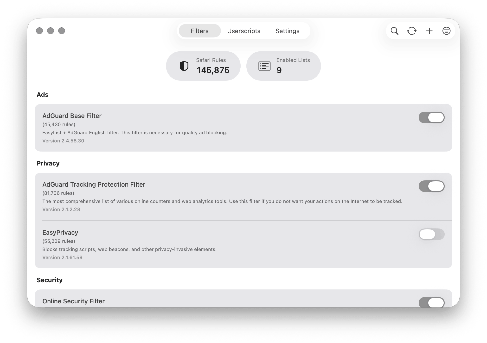
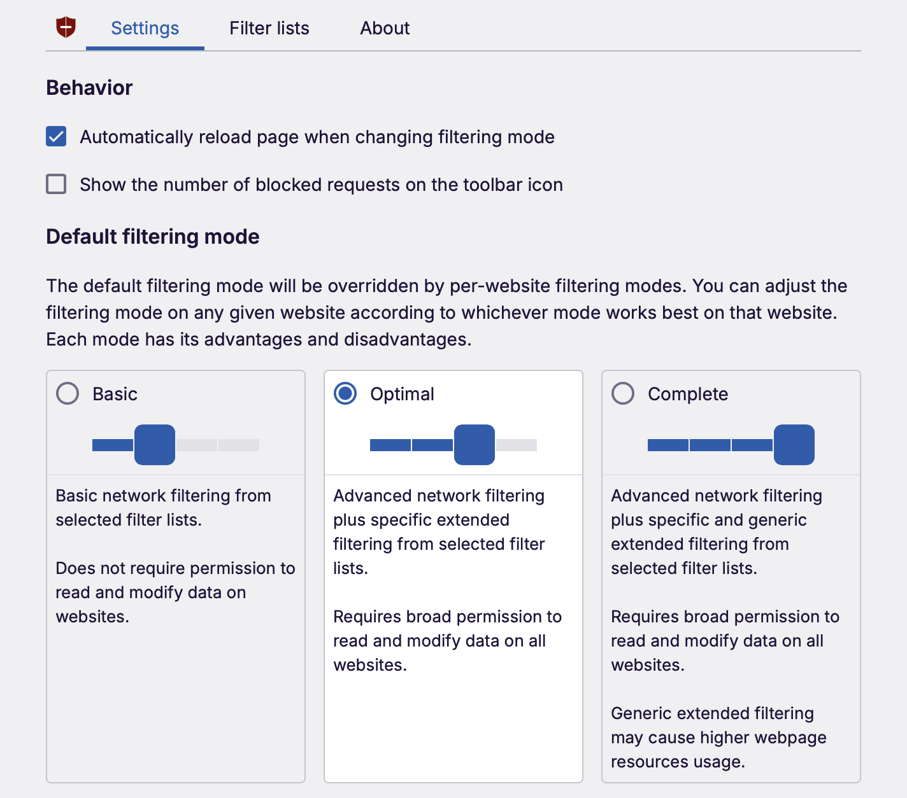
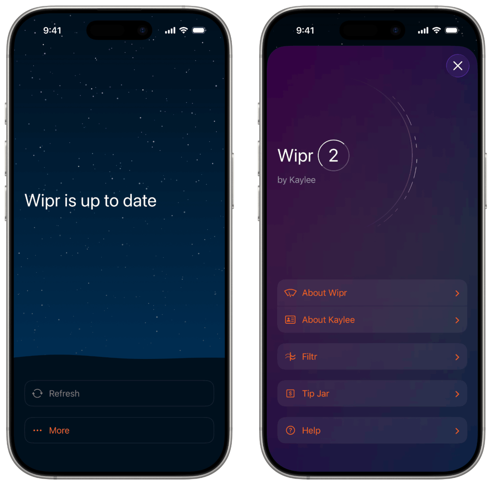
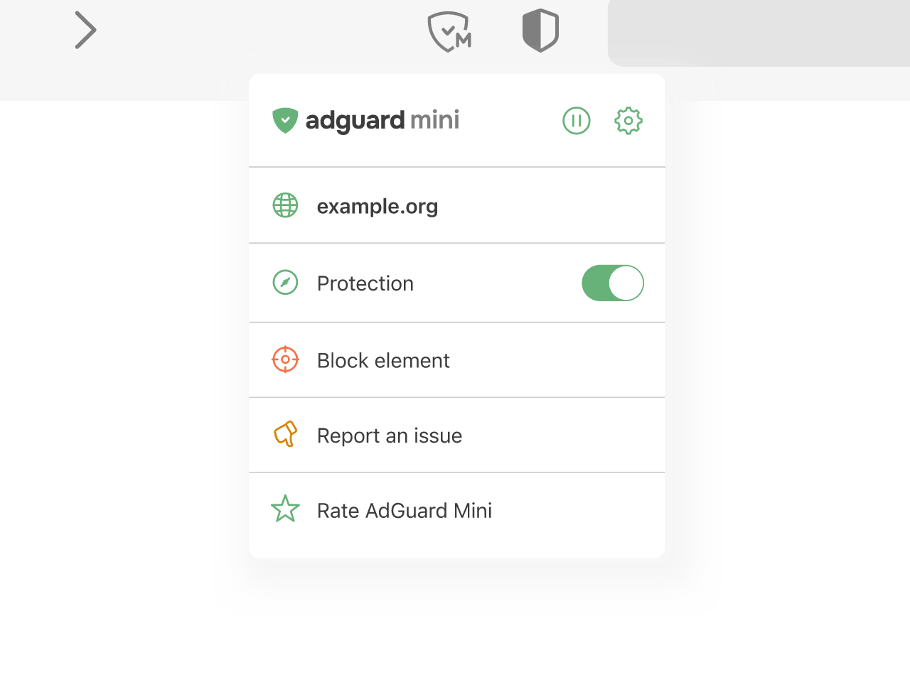

# Safari ad blocker comparison

_Last reviewed September 24, 2026. Covers wBlock 3.1, uBlock Origin Lite, Wipr 2, AdGuard Mini, and AdGuard for iOS._

Safari blockers don't work like uBlock Origin on Firefox. An app hands Safari a compiled list of rules, and Safari applies them inside the browser engine without asking the app anything while a page loads. That's fast and private, but it also means a Safari blocker can't make live decisions about a request. Anything more hands-on (cosmetic filtering, scriptlets, element picking, YouTube fixes, per-site switches) has to live in a Safari Web Extension next to the rules.

Every app here is some mix of those two parts. The differences are in how much of each they give you and how much they let you see.

## Short version

If you want control, pick **wBlock**. You get custom lists, userscripts, userstyles, native video players, per-site switches, iCloud sync, and a view of exactly what each list compiled into.

If you liked uBlock Origin's defaults and never touched the settings, pick **uBlock Origin Lite**. It's declarative, light, and not classic uBO.

If you never want to open the app again, pick **Wipr 2**. It has almost no settings on purpose.

If you already trust AdGuard's filters and don't mind paying for the advanced parts, pick **AdGuard Mini** on the Mac or **AdGuard for iOS**.

## At a glance

| | wBlock | uBlock Origin Lite | Wipr 2 | AdGuard Mini / iOS |
|-|-|-|-|-|
| Best for | Control and visibility | uBO-style defaults | Set and forget | The AdGuard ecosystem |
| Price | Free | Free | One-time purchase | Free, Pro for advanced features |
| Source | GPL-3.0 | GPL-3.0 | Closed | Mini: source-available; iOS: GPL-3.0 |
| Platforms | macOS, iOS, iPadOS, visionOS | macOS, iOS, iPadOS, visionOS | macOS, iOS, iPadOS, visionOS | Mini on macOS; AdGuard for iOS on iPhone, iPad, Vision |
| Rule capacity | 750,000 (5 × 150k) | Browser-managed rulesets | 4 blocklists, total not published | 900,000 on Mini; six 150k slots on iOS |
| Custom lists | Yes | Yes, recently, with limits | No | Yes |
| Userscripts | Yes | No | No | No |
| Element picker | Yes | Cosmetic only | No | Yes |
| Native video players | Yes (Tube Cleaner, Player Cleaner) | No | No | No |
| Logs | Yes | No | No | Yes |
| Sync | iCloud: lists, scripts, settings | No | Settings only | No |

## wBlock

<div align="center">
  <picture>
    <source media="(prefers-color-scheme: dark)" srcset="docs/media/img/filters_macos_dark.png" />
    
  </picture>
</div>

wBlock is my app, so read this section with that in mind. It runs on macOS, iOS, iPadOS, and visionOS (on Vision Pro as an iPad app) with five content blockers of 150,000 rules each. That 750,000 is the compiled Safari count. One AdGuard rule can turn into several Safari rules, or into none if Safari can't express it, and the app shows you both numbers along with the lines it had to drop.

The second half is wBlock Scripts, a Web Extension that does what rules can't. It runs AdGuard scriptlets and cosmetic CSS, strips tracking parameters from links, and hosts a Greasemonkey-compatible userscript engine and UserCSS support. The element zapper lives there too, and lets you step up and down the DOM so you hide the ad container and not a span inside it.

Userscripts are the part no other Safari blocker has. wBlock supports both `GM_*` and `GM.*` for the common APIs, including `GM_xmlhttpRequest` limited to the hosts a script declares. There's a built-in catalog on top of that: Tube Cleaner and Player Cleaner (native Safari video on YouTube and other sites, with SponsorBlock), DeArrow, Dark Reader, Return YouTube Dislike, Bypass Paywalls Clean, and two Twitch ad scripts. Scripts that lean on unusual Tampermonkey behavior may still need fixes.

The Safari toolbar popup has separate switches for filtering, userscripts, and autoplay on the current site. Lists and scripts can also be limited to sites you pick. Updates run on a schedule from hourly to weekly, use diff patches when a list publishes them, and on macOS keep going while the app is closed.

The tradeoff is that wBlock asks more of you. It has more screens than Wipr, and a userscript can break on a site in ways a plain blocklist won't.

Sources: [wBlock on GitHub](https://github.com/0xCUB3/wBlock), [App Store](https://apps.apple.com/us/app/wblock/id6746388723), [Apple content blocker docs](https://developer.apple.com/documentation/safariservices/creating-a-content-blocker)

## uBlock Origin Lite

<div align="center">
  
</div>

uBlock Origin Lite isn't uBO with a smaller UI. It's a separate Manifest V3 project where rules are prepared ahead of time and the browser enforces them, with no filtering process running in the background. The default set is uBO's own lists, EasyList, EasyPrivacy, and Peter Lowe's list, and there are App Store builds for Mac, iPhone, iPad, and Vision Pro. The popup's Basic, Optimal, and Complete modes set how much it's allowed to do on the current site.

Classic uBO gets its power from deciding things at runtime, and MV3 takes most of that away. The uBOL FAQ lists what doesn't carry over: dynamic filtering, response-body rewriting, some `removeparam` cases, and many regex rules. Generic cosmetic filtering is off unless you pick Complete mode.

The FAQ was edited in June 2026 to say custom filters and external list subscriptions are now available, within the declarative design. That closes some of the gap. It's still a low-maintenance blocker and not a workbench.

Sources: [uBOL on GitHub](https://github.com/uBlockOrigin/uBOL-home), [README](https://github.com/uBlockOrigin/uBOL-home/blob/main/README.md), [FAQ](https://github.com/uBlockOrigin/uBOL-home/wiki/Frequently-asked-questions-(FAQ)), [App Store](https://apps.apple.com/us/app/ublock-origin-lite/id6745342698)

## Wipr 2

<div align="center">
  <picture>
    <source media="(prefers-color-scheme: dark)" srcset="docs/media/img/adblock_comparison/wipr_2_dark.png" />
    
  </picture>
</div>

Wipr 2 is close to the opposite of wBlock. You pay once, turn on four blocklist extensions and Wipr Extra, and leave it alone. There's no custom list, no rule editor, no element picker, and no log. Wipr's own FAQ says custom filters and element blocking aren't planned because having no configuration is the point.

It's still a proper Safari blocker. The blocklists are content blockers, and Wipr Extra is a Web Extension for YouTube ads, cookie warnings, and anti-adblock. Extra needs broader site access to do that. Regional lists are picked for you from your device languages. Wipr's help says it doesn't strip UTM parameters, and it asks iOS users not to force-quit the app or updates can stall.

Filtr is a separate in-app purchase that uses Apple's URL Filters API on iOS and macOS 26. It blocks at the URL level across the system without a VPN or DNS server. It's useful, but it sits outside the Safari blocker and needs a new OS.

If Wipr misses something or breaks a site, there's nothing for you to adjust.

Sources: [Wipr 2 on the App Store](https://apps.apple.com/us/app/wipr-2/id1662217862), [Wipr Help](https://kaylees.site/wipr-help.html)

## AdGuard Mini and AdGuard for iOS

<div align="center">
  <picture>
    <source media="(prefers-color-scheme: dark)" srcset="docs/media/img/adblock_comparison/adguard_mini_dark.png" />
    
  </picture>
</div>

AdGuard splits Safari across two apps. AdGuard Mini (formerly AdGuard for Safari) is the Mac one, and AdGuard for iOS covers iPhone, iPad, and Vision. The full AdGuard for Mac is a different, system-wide paid product and isn't compared here.

Mini has six content blockers (General, Privacy, Social, Security, Other, Custom) for a 900,000-rule ceiling. You get filter categories, custom lists, user rules, element blocking, and issue reporting for free. Pro adds real-time filter updates, AdGuard Extra for harder anti-adblock cases, and a few advanced filtering features.

AdGuard for iOS has the same six blockers plus a Web Extension for per-site toggles, element blocking, and (with Premium) advanced rules and scriptlets. It also has DNS protection, which catches ad and tracker domains in other apps but only sees hostnames and can't hide anything on a page. AdGuard and AdGuard Pro on the iOS App Store now unlock the same features, so you only need one.

AdGuard's filter ecosystem is the deepest here, and its rule syntax is what most of these apps (wBlock included) build on. The friction is the two-app split and paying for the good parts.

Sources: [AdGuard Mini](https://adguard.com/en/adguard-mini-mac/overview.html), [Mini on GitHub](https://github.com/AdguardTeam/AdGuardMiniForMac), [rule limit](https://adguard.com/kb/adguard-mini-for-mac/solving-problems/rule-limit/), [AdGuard for iOS](https://adguard.com/en/adguard-ios/overview.html), [iOS on GitHub](https://github.com/AdguardTeam/AdguardForiOS), [Safari protection](https://adguard.com/kb/adguard-for-ios/features/safari-protection/), [Web Extension](https://adguard.com/kb/adguard-for-ios/web-extension/), [AdGuard vs AdGuard Pro](https://adguard.com/kb/adguard-for-ios/adguard-and-adguard-pro/)

## Feature by feature

### Blocking

| | wBlock | uBlock Origin Lite | Wipr 2 | AdGuard Mini / iOS |
|-|-|-|-|-|
| Static rules | Safari content blockers | Browser-managed rulesets | Safari content blockers | Safari content blockers |
| Page-level layer | wBlock Scripts extension | Extension content scripts | Wipr Extra | Web Extension / AdGuard Extra |
| Scriptlets | Yes | Some | Wipr Extra only | Yes (Premium on iOS) |
| Cosmetic filtering | Yes | Yes, depends on mode | Yes | Yes |
| YouTube ads | Yes | Yes, breaks often | Yes, via Wipr Extra | Yes, better with Pro |
| Twitch ads | Yes, opt-in scripts | No dedicated option | Not documented | Via AdGuard Extra (Pro) |
| Tracking-parameter removal | Yes, on by default | Yes (`removeparam`) | No | Yes (`$removeparam`) |
| DNS or system-wide blocking | No | No | Filtr (paid, OS 26) | DNS on iOS; none in Mini |

### Control

| | wBlock | uBlock Origin Lite | Wipr 2 | AdGuard Mini / iOS |
|-|-|-|-|-|
| Custom lists | URL, paste, or file | Yes, with limits | No | Yes |
| User rules | Yes | Custom filters | No | Yes |
| Userscripts | Yes | No | No | No |
| Userstyles | Yes, with Less/Sass/Stylus | No | No | No |
| Element picker | Yes, with saved rules you can edit | Cosmetic only | No | Yes |
| Per-site switches | Filtering, scripts, autoplay | Filtering mode | On/off | On/off |
| Lists limited to chosen sites | Yes | No | No | No |
| Update schedule | Hourly to weekly, diff patches | Ships with extension updates | Automatic | Automatic; real-time with Pro |
| Sync | iCloud | No | Settings only | No |
| Logs | Yes | No | No | Yes |

### Project

| | wBlock | uBlock Origin Lite | Wipr 2 | AdGuard Mini / iOS |
|-|-|-|-|-|
| Written in | Swift + JavaScript | JavaScript | Swift | Swift + web UI |
| GitHub stars (Sep 24, 2026) | 2,943 | 3,804 | n/a | 1,185 Mini / 1,703 iOS |
| App Store privacy label | Data Not Collected | Data Not Collected | Data Not Collected | Data Not Collected |
| Idle RAM, local spot check | ~40 MB | ~120 MB | ~50 MB | ~100 MB (Mini) |

The RAM numbers are rough checks on a 2023 M2 Pro MacBook Pro with a few tabs and one blocker active. Enabled lists, tabs, and sites move them a lot, so don't read them as benchmarks.

## How wBlock works around static rules

Classic uBO can look at every request and decide on the spot. No Safari app can do that through the content blocker API. wBlock gets as close as Safari allows with exception rules, targeted rebuilds, and page scripts.

Turning filtering off for a site adds one rule at the end of the list:

```json
{
  "action": { "type": "ignore-previous-rules" },
  "trigger": { "url-filter": ".*", "if-domain": ["*site.com"] }
}
```

Safari ignores every blocking rule before it on that domain. It's coarser than uBO's dynamic matrix, but it's a real off switch with nothing running in the background. Userscripts and autoplay have their own per-site switches in the extension, so turning filtering off doesn't take them with it.

Changes are tracked per list and per blocker. Toggling one list recompiles only the blockers that list feeds, and an `@@` exception stays in the same blocker as the rule it cancels even when the two lists would otherwise land in different ones. Safari still has to reload the affected rule sets before a change applies, and there's no way around that.

Whatever a network rule can't express goes to wBlock Scripts: cosmetic CSS, scriptlets, userscripts, the zapper, and URL cleanup. Safari's content blocker API can block a request but can't rewrite its URL, so stripping `utm_*` has to happen in a script before navigation.

## Notes

Safari caps each content blocker at 150,000 compiled rules. wBlock has five, AdGuard has six, Wipr has four and doesn't publish a total. uBOL's limits come from the browser's declarative ruleset handling, not content blocker slots.

The paid standalone AdGuard for Mac supports userscripts. AdGuard Mini and AdGuard for iOS don't.

GitHub's language bars count bundled filter data, so the "written in" row describes the apps as built, not the repo percentages.

There's no ad-block tester score here on purpose. Those sites mostly measure which lists are on, and one list update can change the result.

## Sources

- [Apple: Creating a content blocker](https://developer.apple.com/documentation/safariservices/creating-a-content-blocker)
- [uBOL README](https://github.com/uBlockOrigin/uBOL-home/blob/main/README.md) and [FAQ](https://github.com/uBlockOrigin/uBOL-home/wiki/Frequently-asked-questions-(FAQ))
- [Wipr Help](https://kaylees.site/wipr-help.html)
- [AdGuard Mini](https://adguard.com/en/adguard-mini-mac/overview.html), [rule limit](https://adguard.com/kb/adguard-mini-for-mac/solving-problems/rule-limit/), [AdGuard for iOS](https://adguard.com/en/adguard-ios/overview.html), [Safari protection](https://adguard.com/kb/adguard-for-ios/features/safari-protection/), [Web Extension](https://adguard.com/kb/adguard-for-ios/web-extension/)
- GitHub API for [wBlock](https://api.github.com/repos/0xCUB3/wBlock), [uBOL](https://api.github.com/repos/uBlockOrigin/uBOL-home), [AdGuard Mini](https://api.github.com/repos/AdguardTeam/AdGuardMiniForMac), and [AdGuard for iOS](https://api.github.com/repos/AdguardTeam/AdguardForiOS)
