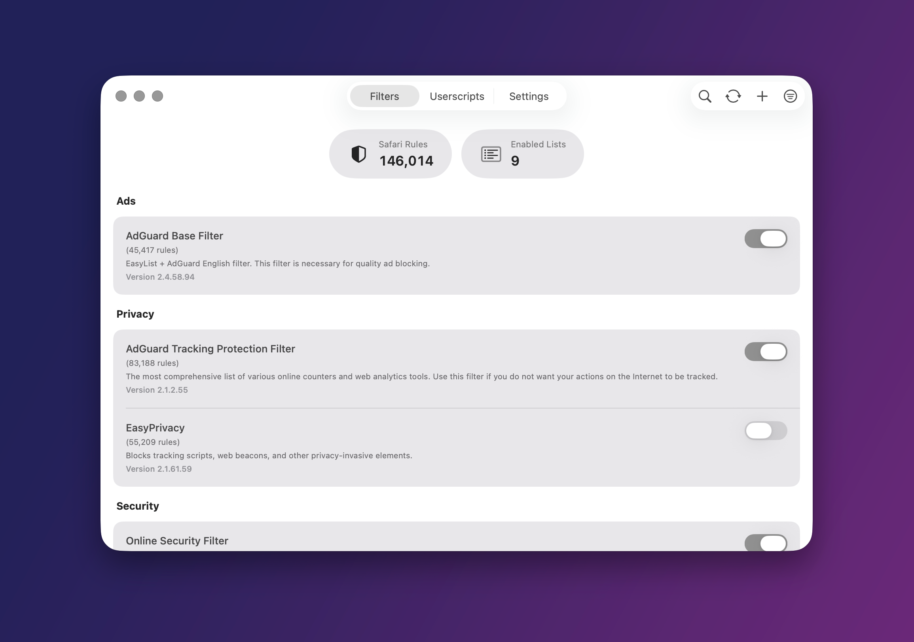
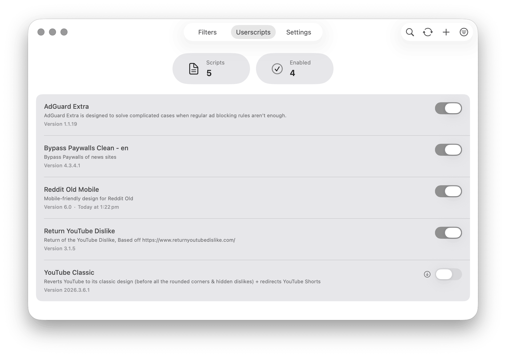
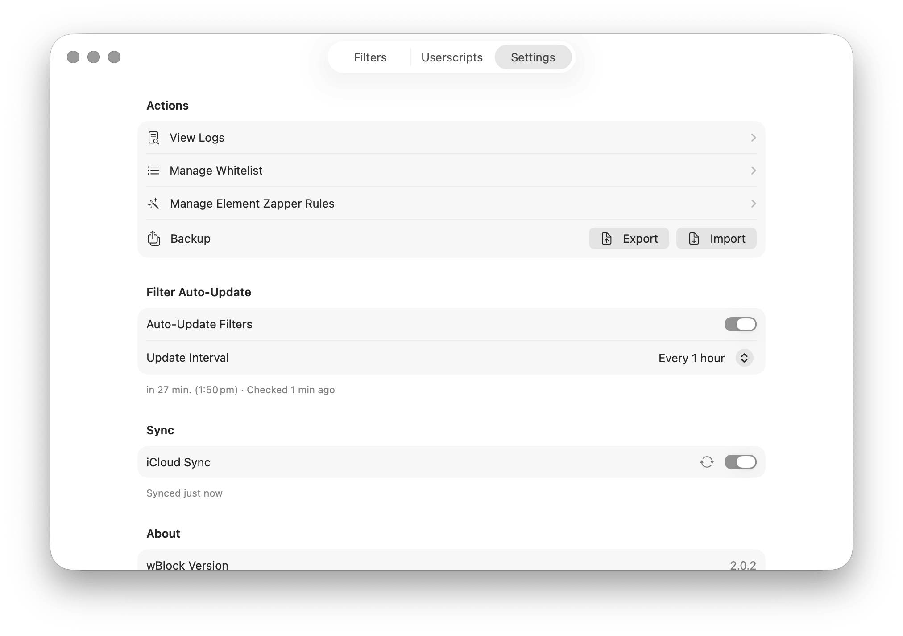
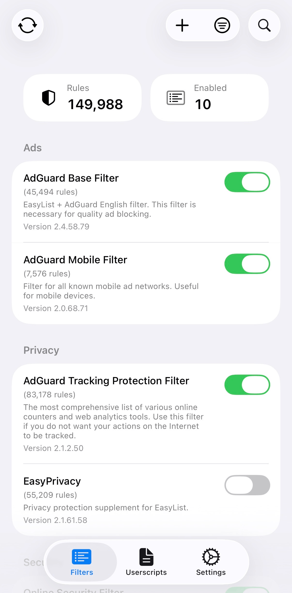
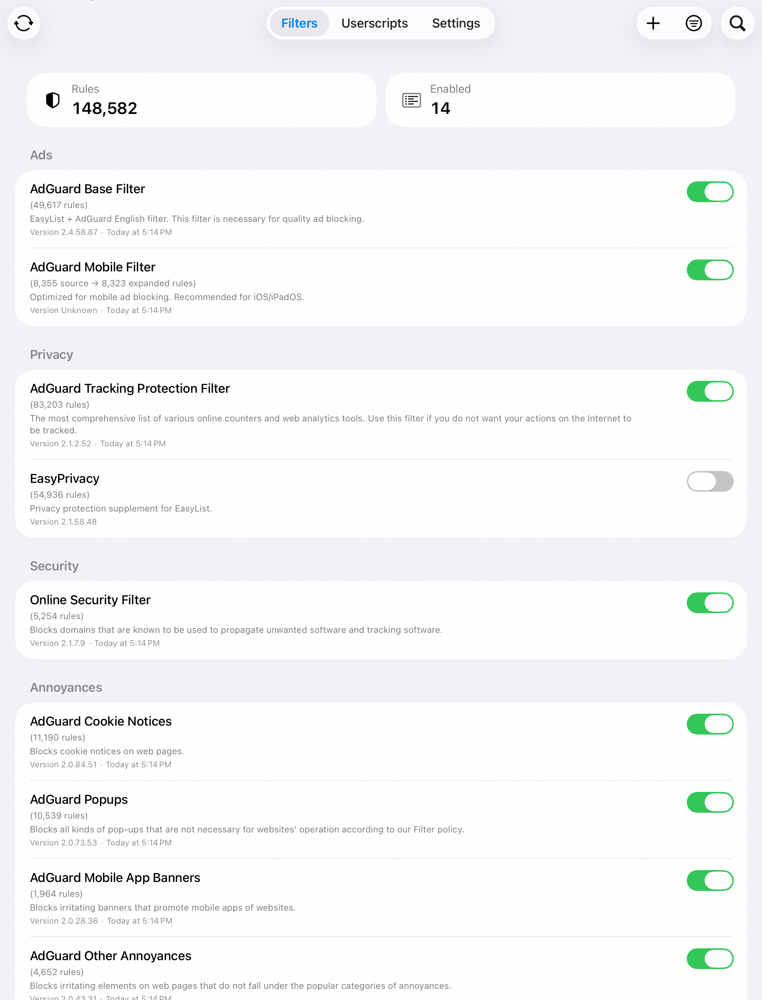

<picture>
  
</picture>

# wBlock

**The end of Safari ad-blocking B.S.**

 

<a href="https://apps.apple.com/us/app/wblock/id6746388723?itscg=30200&itsct=apps_box_badge&mttnsubad=6746388723">
  <picture>
    <source media="(prefers-color-scheme: dark)" srcset="https://toolbox.marketingtools.apple.com/api/v2/badges/download-on-the-app-store/white/en-us?releaseDate=1760313600" width="245" height="82" />
    <source media="(prefers-color-scheme: light)" srcset="https://toolbox.marketingtools.apple.com/api/v2/badges/download-on-the-app-store/black/en-us?releaseDate=1760313600" width="245" height="82" />
    
  </picture>
</a>
    

 
 

 
 

  <picture>
    <source media="(prefers-color-scheme: dark)" srcset="docs/media/img/hero_image_dark.png" width="900" />
    <source media="(prefers-color-scheme: light)" srcset="docs/media/img/hero_image_light.png" width="900" />
    
  </picture>

 

A Safari content blocker for macOS, iOS, and iPadOS. 
750,000 rules across 5 extensions, Protocol Buffer storage, LZ4 compression, and iCloud sync.

 

> [!NOTE]
> **Looking for a detailed comparison?** Check out my [comparison guide](Adblock_Comparison.md) to see how wBlock stacks up against other Safari content blockers.

 

## Features

<table align="center">
<tr>
<td width="50%" valign="top">

### Performance
- **750,000 rule capacity** across 5 Safari content blocking extensions per platform (150k each)
- **~40 MB RAM** at idle — Safari's native content blocking API runs rules out-of-process
- **Protocol Buffers + LZ4** for filter storage; streaming I/O keeps memory low during compilation
- **HTTP conditional requests** (If-Modified-Since/ETag) so updates only download what changed
- **iCloud sync** for filter selections, custom lists, userscripts, and whitelist across devices

### Content modification
- **Element Zapper** (macOS, iOS, iPadOS, visionOS) — visually select and hide page elements in Safari
- **Userscript engine** with Greasemonkey API (GM_getValue, GM_setValue, GM_xmlhttpRequest)
- **Custom filter lists** via URL, paste, or file import — supports any AdGuard-syntax blocklist
- **Toolbar search** for quickly finding filters and userscripts
- **Automatic rule distribution** across all 5 content blocker slots for maximum coverage

</td>
<td width="50%" valign="top">

### Blocking
- **Network request blocking** — ads, trackers, cookie banners, annoyances
- **CSS injection** for cosmetic filtering and element hiding
- **Script blocking** for unwanted JavaScript
- **Pop-up and redirect prevention**

### Configuration
- **Auto-updates** from every hour to every 7 days, or manual. macOS can keep checking through a bundled launch agent and background update service, iOS background checks are best-effort
- **Per-site controls** — disable blocking on specific sites from the Safari toolbar
- **Blocked request logger** (macOS) — see what's being blocked on each page
- **Whitelist** for trusted domains
- **Regional filters** with auto-detection based on your locale
- **Homebrew cask** for macOS: `brew tap 0xcub3/wblock https://github.com/0xCUB3/wBlock && brew install --cask wblock`

</td>
</tr>
</table>

 

---

 

## Screenshots

 

<table>
<tr>
<td align="center">
  <picture>
    <source media="(prefers-color-scheme: dark)" srcset="docs/media/img/userscripts_macos_dark.png" width="700" />
    <source media="(prefers-color-scheme: light)" srcset="docs/media/img/userscripts_macos_light.png" width="700" />
    
  </picture>
 
<strong>Userscript Management</strong> 
<em>Manage paywalls, YouTube Dislikes, and more</em>
  
</td>
</tr>
<tr>
<td align="center">
  <picture>
    <source media="(prefers-color-scheme: dark)" srcset="docs/media/img/settings_macos_dark.png" width="700" />
    <source media="(prefers-color-scheme: light)" srcset="docs/media/img/settings_macos_light.png" width="700" />
    
  </picture>
 
<strong>Settings & Customization</strong> 
<em>Configure auto-updates, notifications, and preferences</em>
  
</td>
</tr>
<tr>
<td align="center">
  <picture>
    <source media="(prefers-color-scheme: dark)" srcset="docs/media/img/filters_ios_dark.png" width="350" />
    <source media="(prefers-color-scheme: light)" srcset="docs/media/img/filters_ios_light.png" width="350" />
    
  </picture>
  
<strong>iOS Interface</strong> 
<em>Full-featured blocking on iPhone</em>
  
</td>
</tr>
<tr>
<td align="center">
  <picture>
    <source media="(prefers-color-scheme: dark)" srcset="docs/media/img/filters_ipados_dark.png" width="700" />
    <source media="(prefers-color-scheme: light)" srcset="docs/media/img/filters_ipados_light.png" width="700" />
    
  </picture>
  
<strong>iPadOS Interface</strong> 
<em>Full-featured blocking on iPad</em>
  
</td>
</tr>
</table>

 

---

 

## Technical Implementation

<table>
<tr>
<td width="50%" valign="top">

**Core Architecture**
- Protocol Buffers (libprotobuf) with LZ4 compression for filter serialization
- Asynchronous I/O with Swift concurrency (async/await, Task, Actor isolation)
- Streaming serialization to disk minimizes peak memory usage during compilation
- 5 Safari content blocking extensions per platform (maximum Safari API capacity)
- SafariServices framework integration for declarative content blocking

</td>
<td width="50%" valign="top">

**Dependencies & Standards**
- SafariConverterLib v4.2.1 for AdGuard to Safari rule conversion
- AdGuard Scriptlets v2.3.0 for advanced blocking techniques
- Swift 5.9+ with strict concurrency checking enabled
- WCAG 2.1 AA compliance with full VoiceOver and Dynamic Type support
- SwiftProtobuf for cross-platform filter storage format

</td>
</tr>
</table>

---

 

## Support Development

wBlock is free and open source. 
If you want to support the project:

 

 

---

 

## FAQ

<b>How does wBlock compare to other ad blockers?</b>

 
Check out our <a href="Adblock_Comparison.md">comparison guide</a> vs uBlock Origin Lite, Wipr 2, and AdGuard Mini.

<b>Can I use my own filter lists?</b>

 
Yes. You can add any AdGuard-compatible filter list by URL, paste rules directly, or import from a file.

<b>Does wBlock slow down Safari?</b>

 
No. wBlock uses Safari's native declarative content blocking API, which processes rules in a separate process. Memory overhead is ~40 MB at idle with no measurable impact on page load times.

<b>Do userscripts work on iOS and iPadOS?</b>

 
Yes. The userscript engine implements the Greasemonkey API (GM_getValue, GM_setValue, GM_xmlhttpRequest, GM_addStyle) on iOS, iPadOS, and macOS via Safari Web Extensions.

<b>How often do filters update?</b>

 
Auto-update intervals are configurable from 1 hour to 7 days, or manually triggered. On macOS, enabling auto-update registers a bundled launch agent that can keep checking while the app is closed through a background update service. On iOS and iPadOS, background checks are best-effort and may wait until the system wakes wBlock or you reopen it. Opening Safari does not trigger updates. Updates use HTTP conditional requests (If-Modified-Since/ETag headers) to minimize bandwidth usage.

<b>Is the element zapper available on iOS and iPadOS?</b>

 
Yes. Open the wBlock extension popup in Safari and tap <i>Activate Element Zapper</i>.

 

---

 

### Credits

**[@arjpar](https://github.com/arjpar)** · **[@ameshkov](https://github.com/ameshkov/safari-blocker)** · **[@shindgewongxj](https://github.com/shindgewongxj)**

 

 

Developed by [0xCUB3](https://github.com/0xCUB3)

 

---

 

<a href="https://www.star-history.com/?repos=0xCUB3%2FwBlock&type=date&legend=bottom-right">
  <picture>
    <source media="(prefers-color-scheme: dark)" srcset="https://api.star-history.com/chart?repos=0xCUB3/wBlock&type=date&theme=dark&legend=bottom-right" />
    <source media="(prefers-color-scheme: light)" srcset="https://api.star-history.com/chart?repos=0xCUB3/wBlock&type=date&legend=bottom-right" />
    
  </picture>
</a>

