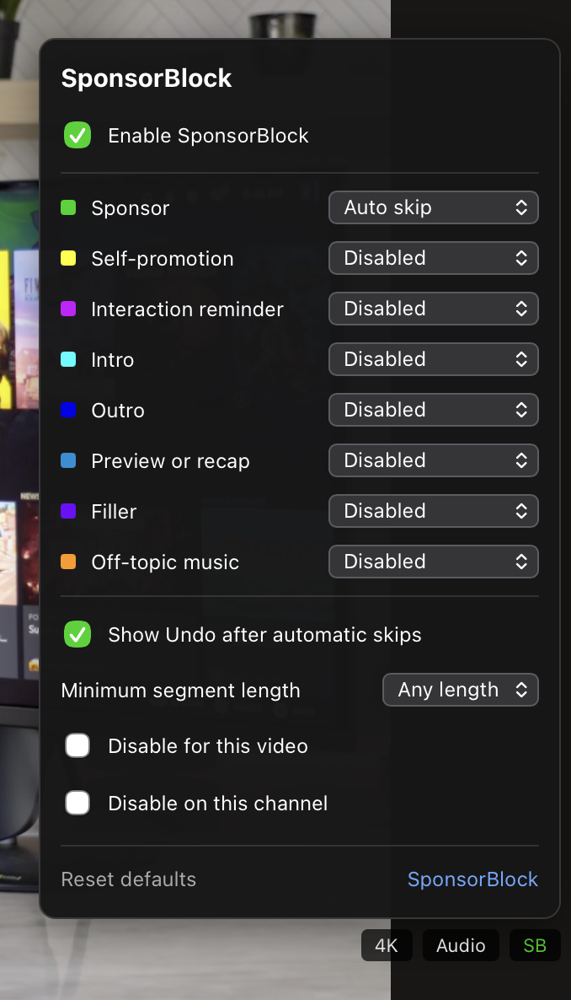
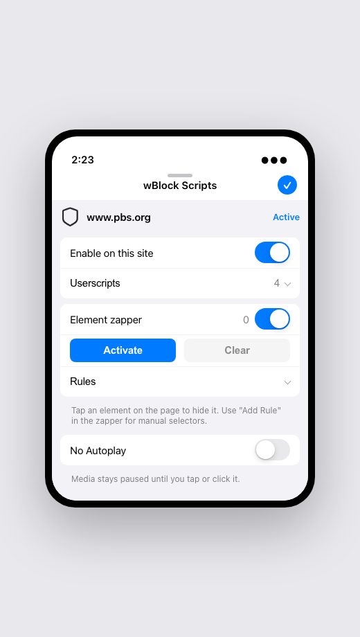

# wBlock

**The end of Safari ad-blocking B.S.**

A free, open-source ad blocker for Safari on Mac, iPhone, iPad, and Apple Vision Pro.

 

<a href="https://apps.apple.com/us/app/wblock/id6746388723?itscg=30200&itsct=apps_box_badge&mttnsubad=6746388723">
  <picture>
    <source media="(prefers-color-scheme: dark)" srcset="https://toolbox.marketingtools.apple.com/api/v2/badges/download-on-the-app-store/white/en-us?releaseDate=1760313600" width="220" />
    <source media="(prefers-color-scheme: light)" srcset="https://toolbox.marketingtools.apple.com/api/v2/badges/download-on-the-app-store/black/en-us?releaseDate=1760313600" width="220" />
    
  </picture>
</a>

 
 

 

 

Safari gives ad blockers very little room. Each content blocker gets 150,000 rules and can't touch a page's JavaScript. wBlock ships five of them (750,000 rules) plus a scripts extension for everything a rule can't do. That covers scriptlets, cosmetic filters, userscripts and userstyles, an element zapper, and native video players for YouTube and most other sites.

It's free and collects nothing. If a list misbehaves, you can see what it compiled into, which lines Safari threw out, and what changed on the last update.

> [!TIP]
> Deciding between wBlock, uBlock Origin Lite, Wipr, and AdGuard? I wrote a [comparison](Adblock_Comparison.md).

 

## What's in it

### Blocking

- Filter lists in AdGuard syntax, compiled into Safari rules and spread across five blockers. Safari does the matching itself, and wBlock sits around 40 MB when idle.
- Good defaults, regional lists picked from your language, annoyance and cookie-banner lists, and anything you add by URL, paste, or file.
- Updates on a schedule you pick, hourly to weekly. Lists that publish diff patches only download what changed. On macOS a small launch agent keeps checking even when the app is closed.
- Tracking parameters like `utm_*` get stripped from links, and link shorteners get unwrapped. That's on by default.
- A capacity bar, and a rules viewer that tells you which lines were unsupported, duplicated, or handed to the scripts extension.

### Userscripts and userstyles

- A Greasemonkey-compatible engine with both `GM_*` and `GM.*`. `GM_xmlhttpRequest` only reaches hosts a script lists in `@connect`.
- UserCSS themes (`.user.css`), including Less, Sass, and Stylus. More in [docs/USERSTYLES.md](docs/USERSTYLES.md).
- A built-in catalog with Tube Cleaner, Player Cleaner, DeArrow, Dark Reader, Return YouTube Dislike, Bypass Paywalls Clean, AdGuard Extra, AdGuard Popup Blocker, and TwitchAdSolutions. Everything in it ships off except tinyShield, an anti-adblock defuser.

### Native video

Tube Cleaner and Player Cleaner hand a site's video back to Safari before the page paints. You get Picture-in-Picture, background audio, fullscreen, and Now Playing, same as a plain `<video>` tag.

Tube Cleaner is the YouTube one. It keeps YouTube's own stream, puts chapters and captions in Safari's native menus, and skips sponsors through SponsorBlock with per-category settings. If you also want better titles and thumbnails, DeArrow is a separate script. Player Cleaner does the same job on video.js, JW Player, Plyr, Flowplayer, MediaElement, Clappr, Media Chrome, and shadow-root players like Archive.org's, and it remembers speed, volume, captions, and where you left off on each site.

Both update from [wBlock-userscripts](https://github.com/0xCUB3/wBlock-userscripts) on their own schedule, separate from the app. They don't block ads (the filter lists do that).

### Per-site control

Click the toolbar button on any site and you get separate switches for filtering, userscripts, and autoplay, plus the element zapper. You can also limit a filter list or a userscript to certain sites, or keep it off them. Zapper rules stay editable in Settings.

### Every device

It's one app on macOS, iOS, iPadOS, and visionOS. iCloud syncs your lists, custom filters, userscripts, allowlist, and settings. If you'd rather keep things local, export a backup instead.

 

## Screenshots

<table>
<tr>
<td colspan="2" align="center">
  <picture>
    <source media="(prefers-color-scheme: dark)" srcset="docs/media/img/userscripts_macos_dark.png" />
    
  </picture>
   Userscripts on macOS
</td>
</tr>
<tr>
<td align="center" width="50%">
  
   SponsorBlock in Tube Cleaner
</td>
<td align="center" width="50%">
  <picture>
    <source media="(prefers-color-scheme: dark)" srcset="docs/media/img/scripts_popup_ios_dark.png" />
    
  </picture>
   The Safari popup on iPhone
</td>
</tr>
<tr>
<td colspan="2" align="center">
  <picture>
    <source media="(prefers-color-scheme: dark)" srcset="docs/media/img/settings_macos_dark.png" />
    
  </picture>
   Settings on macOS
</td>
</tr>
</table>

 

## Install

- [App Store](https://apps.apple.com/us/app/wblock/id6746388723). It updates itself, and it's the one I'd use.
- Homebrew: `brew tap 0xcub3/wblock && brew install --cask wblock`
- DMG from the [latest release](https://github.com/0xCUB3/wBlock/releases/latest).

All three are the same build. On first launch wBlock walks you through turning the extensions on in Safari.

 

## How it works

wBlock has three parts. The app downloads your lists, converts them with [SafariConverterLib](https://github.com/AdguardTeam/SafariConverterLib) 4.3.0, and splits the result across five content blockers (Ads, Privacy, Security, Foreign, Custom). Safari compiles those and applies them on its own, and no wBlock code runs while a page loads. Anything a static rule can't express goes to the wBlock Scripts extension.

Filter data lives in Protocol Buffers with LZ4 compression and is streamed to disk to keep big compiles from spiking memory. If you change one list, only the blockers that list feeds get rebuilt. Safari still has to reload them before you see the change, and no app can skip that.

The [comparison](Adblock_Comparison.md#how-wblock-works-around-static-rules) shows the exact rule wBlock writes when you turn filtering off for a site.

 

## FAQ

Should I run wBlock alongside another ad blocker?

 

No. Pick one general-purpose blocker.

Two blockers fight over the same requests and the same page. Mozilla's [webRequest docs](https://developer.mozilla.org/en-US/docs/Mozilla/Add-ons/WebExtensions/API/webRequest/onHeadersReceived) say that when two extensions change one response in conflicting ways, only one of them wins. uBlock Origin's README says "Do NOT use uBO with any other content blocker" ([source](https://github.com/gorhill/ublock#all-programs)), and AdGuard warns about slow loading, broken sites, and video trouble ([source](https://adguard.com/en/adguard-browser-extension/opera/overview.html)).

It also makes your bug report useless. With two blockers on, I can't tell which one let the ad through or broke the site. Turn the other one off before you file anything.

Should I turn on more filter lists?

 

Usually not. The defaults already catch most ads and trackers, and other general lists mostly repeat them. Extra lists eat into Safari's rule limit and break more sites. Annoyances lists (cookie banners, popups, social widgets) and regional lists for non-English sites are worth turning on.

Does wBlock slow Safari down?

 

Not in normal use. Safari applies the rules itself, outside wBlock, and a page load never waits on the app. It idles around 40 MB.

How do I block Twitch ads?

 

Turn on TwitchAdSolutions (vaft) or AdGuard Extra in the Userscripts tab and reload Twitch. vaft is the dedicated one. Don't run both. Twitch changes its ad setup often, and either script can break for a while until it catches up.

Why don't cookie banners or scriptlets work in Private Browsing?

 

Safari keeps extensions off in Private Browsing until you allow each one, and cookie-banner filters mostly run as scriptlets in wBlock Scripts. In Safari → Settings → Extensions, turn on Allow in Private Browsing for wBlock Scripts and all five blockers, then reload the private window.

If a banner is already gone in a normal window, you may just have a consent cookie saved there. Clear the site's cookies before you compare.

How do userscript network requests work?

 

A script needs `@grant GM_xmlhttpRequest` (or `GM.xmlHttpRequest`), and it can only reach hosts listed in its `@connect` lines. A bare host covers its subdomains too, and `localhost`, `self`, and `*` work. Without `@connect` a script can only talk to the site it runs on. There's no per-domain prompt yet.

Only HTTP and HTTPS are allowed. Redirects get checked before they're followed, and if Safari hides a redirect from the extension the request fails instead of slipping past the list. Requests don't carry your browser cookies or saved logins, and `anonymous` requests also drop cookies the script set.

Where are Tube Cleaner and Player Cleaner?

 

Top of the Userscripts tab, under General. Both ship off. Once one is on, each feature (chapters, captions, SponsorBlock, and so on) has its own switch. If Player Cleaner breaks a site, turn it off for that site from the toolbar popup.

How often do filters update?

 

As often as you set it, from hourly to weekly, or only when you hit refresh. On macOS the launch agent checks while the app is closed (you can turn that off). On iPhone and iPad, iOS decides when to wake wBlock, and sometimes that's not until you open it.

 

## Support

wBlock is free and it'll stay free. If you want to chip in, there's Open Collective.

Bugs and feature requests go in [Issues](https://github.com/0xCUB3/wBlock/issues). For anything else, ask on [Discord](https://discord.gg/Y3yTFPpbXr). The [privacy policy](PRIVACY_POLICY.md) is short.

 

## Credits

Built with help from [@arjpar](https://github.com/arjpar), [@ameshkov](https://github.com/ameshkov), and [@shindgew](https://github.com/shindgew). Rule conversion and scriptlets come from [AdGuard](https://github.com/AdguardTeam). SponsorBlock and DeArrow data come from [Ajay Ramachandran's](https://sponsor.ajay.app/) projects under CC BY-NC-SA 4.0.

 

<a href="https://www.star-history.com/?repos=0xCUB3%2FwBlock&type=date&legend=top-left">
 <picture>
   <source media="(prefers-color-scheme: dark)" srcset="https://api.star-history.com/chart?repos=0xCUB3/wBlock&type=date&theme=dark&legend=top-left&sealed_token=FHF3tvPu6mhBn3K4_1fpH1nj2W36bTa6aW6_u-990mCb5zN_PRort245hoHzQEhFBRJo38qUYoOzU1huHG4_mHDsYpO7YxzKOIJEUaQI4NQNRDSdt9aZ_T1PVVSIaXqpdYnrBTTIlKhCEkYdneNsXEnpXhiUB3GW2F-tnsMNC4DPQJUKAmJK90omDnb2" />
   
 </picture>
</a>

