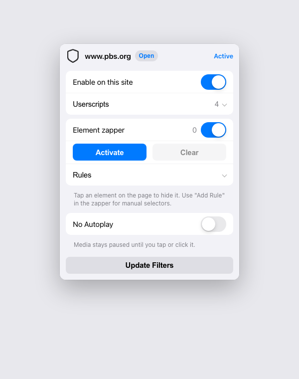

# wBlock

**The end of Safari ad-blocking B.S.**

A free, open-source ad blocker for Safari on Mac, iPhone, iPad, and Apple Vision Pro.

 

<a href="https://apps.apple.com/us/app/wblock/id6746388723?itscg=30200&itsct=apps_box_badge&mttnsubad=6746388723">
  <picture>
    <source media="(prefers-color-scheme: dark)" srcset="https://toolbox.marketingtools.apple.com/api/v2/badges/download-on-the-app-store/white/en-us?releaseDate=1760313600" width="220" />
    <source media="(prefers-color-scheme: light)" srcset="https://toolbox.marketingtools.apple.com/api/v2/badges/download-on-the-app-store/black/en-us?releaseDate=1760313600" width="220" />
    
  </picture>
</a>

 
 

 

 

Safari gives ad blockers a small box to work in. Each content blocker gets 150,000 rules, and none of them can touch a page's JavaScript. wBlock ships five blockers, so you get 750,000 rules, and a separate scripts extension for the jobs rules can't do: scriptlets, cosmetic filtering, userscripts, userstyles, an element zapper, and native video players for YouTube and everything else.

It's free, it collects nothing, and it shows its work. You can see how many rules each list turned into, which lines Safari refused, and what changed on the last update.

> [!TIP]
> Choosing between wBlock, uBlock Origin Lite, Wipr, and AdGuard? The [comparison guide](Adblock_Comparison.md) covers all four.

 

## What's in it

### Blocking

- AdGuard-syntax lists compiled into Safari's native rules and spread across five blockers. Safari does the matching in its own process, and wBlock idles around 40 MB.
- Sensible defaults, regional lists picked from your locale, annoyance and cookie-banner lists, and any list you add by URL, paste, or file.
- Scheduled updates, anywhere from hourly to weekly. Lists that publish diff patches update incrementally. Everything else goes through `ETag` / `If-Modified-Since`. On macOS a small launch agent keeps checking while the app is closed.
- Tracking parameters like `utm_*` stripped from links, and shortener redirects unwrapped. This is on by default.
- A capacity bar and a rules viewer that flags unsupported, duplicate, and Scripts-only lines.

### Userscripts and userstyles

- A Greasemonkey-compatible engine with both `GM_*` and `GM.*` APIs: storage, resources, menu commands, styles, and `GM_xmlhttpRequest` limited to the hosts a script declares in `@connect`.
- UserCSS themes (`.user.css`) applied as plain CSS, with Less, Sass, and Stylus preprocessing. See [docs/USERSTYLES.md](docs/USERSTYLES.md).
- A built-in catalog you can switch on: Tube Cleaner, Player Cleaner, DeArrow, Dark Reader, Return YouTube Dislike, Bypass Paywalls Clean, AdGuard Extra, AdGuard Popup Blocker, and TwitchAdSolutions. Only tinyShield, an anti-adblock defuser, is on out of the box.

### Native video

Tube Cleaner and Player Cleaner give a site's video element back to Safari before the page paints. Picture-in-Picture, background audio, fullscreen, and Now Playing work the way they do on a plain `<video>`.

Tube Cleaner is for YouTube. It keeps YouTube's own stream and adds Safari's controls, chapters and captions in the native menus, and SponsorBlock skipping with per-category settings. DeArrow is a separate script if you want better titles and thumbnails too. Player Cleaner does the same for video.js, JW Player, Plyr, Flowplayer, MediaElement, Clappr, Media Chrome, and shadow-root players like Archive.org's. It also remembers speed, volume, captions, and resume position per site.

Both update from [wBlock-userscripts](https://github.com/0xCUB3/wBlock-userscripts) on their own schedule, not with the app. Ads are still the job of the filter lists.

### Per-site control

The Safari toolbar popup has separate switches for content filtering, userscripts, and autoplay on the current site, plus the element zapper. Filter lists and userscripts can also be limited to sites you pick or kept off specific ones. Zapper rules stay editable in Settings, and No Autoplay keeps media paused until you press play.

### Everywhere you use Safari

The same app runs on macOS, iOS, iPadOS, and visionOS. iCloud syncs your lists, custom filters, userscripts, allowlist, and settings, and you can export a backup if you'd rather keep it local.

 

## Screenshots

<table>
<tr>
<td colspan="2" align="center">
  <picture>
    <source media="(prefers-color-scheme: dark)" srcset="docs/media/img/userscripts_macos_dark.png" />
    
  </picture>
   Userscripts on macOS
</td>
</tr>
<tr>
<td align="center" width="50%">
  <picture>
    <source media="(prefers-color-scheme: dark)" srcset="docs/media/img/filters_ios_dark.png" />
    
  </picture>
   Filters on iPhone
</td>
<td align="center" width="50%">
  <picture>
    <source media="(prefers-color-scheme: dark)" srcset="docs/media/img/scripts_popup_macos_dark.png" />
    
  </picture>
   The Safari toolbar popup
</td>
</tr>
<tr>
<td colspan="2" align="center">
  <picture>
    <source media="(prefers-color-scheme: dark)" srcset="docs/media/img/settings_macos_dark.png" />
    
  </picture>
   Settings on macOS
</td>
</tr>
<tr>
<td colspan="2" align="center">
  <picture>
    <source media="(prefers-color-scheme: dark)" srcset="docs/media/img/filters_ipados_dark.png" />
    
  </picture>
   Filters on iPad
</td>
</tr>
</table>

 

## Install

| | |
|-|-|
| App Store | [wBlock on the App Store](https://apps.apple.com/us/app/wblock/id6746388723). Updates itself, and it's the one I'd pick. |
| Homebrew | `brew tap 0xcub3/wblock && brew install --cask wblock` |
| DMG | [Latest release](https://github.com/0xCUB3/wBlock/releases/latest) |

All three are the same app with the same features. Onboarding walks you through turning on the extensions in Safari.

 

## How it works

wBlock is three pieces. The app downloads lists, converts them with [SafariConverterLib](https://github.com/AdguardTeam/SafariConverterLib) 4.3.0, and splits the output across five content blockers (Ads, Privacy, Security, Foreign, Custom). Safari compiles those and applies them itself, with no wBlock code in the page load. The wBlock Scripts extension carries everything a static rule can't express: AdGuard scriptlets, cosmetic CSS, URL cleanup, userscripts, userstyles, the zapper, and No Autoplay.

Filter data is stored as Protocol Buffers with LZ4 compression and written to disk in a stream, so a large compile doesn't spike memory. A change to one list rebuilds only the blockers it touches. Safari still has to reload those rule sets before the change applies, and nothing an app does can skip that step.

If you want the per-site switch in detail, the [comparison guide](Adblock_Comparison.md#how-wblock-works-around-static-rules) has the actual rule wBlock writes.

 

## FAQ

<b>Should I run wBlock alongside another ad blocker?</b>

 

No. Use one general-purpose blocker at a time.

Two blockers fight over the same requests and the same page. Mozilla documents that when two extensions make conflicting changes to one response, only one of them wins ([webRequest docs](https://developer.mozilla.org/en-US/docs/Mozilla/Add-ons/WebExtensions/API/webRequest/onHeadersReceived)). uBlock Origin's README says "Do NOT use uBO with any other content blocker" ([source](https://github.com/gorhill/ublock#all-programs)), and AdGuard warns about slower loading, broken sites, and video problems ([source](https://adguard.com/en/adguard-browser-extension/opera/overview.html)).

It also makes bug reports useless. If an ad gets through or a site breaks with two blockers on, either one could be responsible. Turn the others off before you file an issue.

<b>Should I turn on more filter lists?</b>

 

Usually not. The defaults cover most ads and trackers, and most other general lists overlap with them. More lists mostly eat into Safari's rule limit and break more sites. The exceptions are the Annoyances lists (cookie banners, popups, social widgets) and regional lists for non-English sites.

<b>Does wBlock slow Safari down?</b>

 

Not in normal use. Safari applies the compiled rules itself, outside wBlock's process, and page loads never wait on wBlock. Idle memory sits around 40 MB in my checks.

<b>How do I block Twitch ads?</b>

 

Turn on one of the two Twitch scripts in the Userscripts tab, then reload Twitch. <i>TwitchAdSolutions (vaft)</i> is the dedicated option. <i>AdGuard Extra</i> also handles Twitch along with other anti-adblock cases. Don't run both.

Twitch changes how it serves ads often, so either one can break for a while until the script catches up.

<b>Why don't cookie banners or scriptlets work in Private Browsing?</b>

 

Safari keeps extensions off in Private Browsing until you allow each one. Cookie-banner filters usually work through scriptlets, and those run in wBlock Scripts.

Go to Safari → Settings → Extensions and turn on <i>Allow in Private Browsing</i> for wBlock Scripts and all five wBlock blockers, then reload the private window. If a banner is already gone in a normal window, that may just be a stored consent cookie, so clear the site's cookies before comparing.

<b>How do userscript network requests work?</b>

 

`GM_xmlhttpRequest` needs `@grant GM_xmlhttpRequest` or `@grant GM.xmlHttpRequest`, and it only reaches hosts listed in the script's `@connect` metadata. A bare host allows its subdomains too, and `localhost`, `self`, and `*` are supported. Without `@connect`, a script can only reach the site it's running on. There's no per-domain prompt yet.

Only HTTP and HTTPS are allowed. Redirects are checked before they're followed, and a redirect Safari hides from the extension fails instead of slipping past the allowlist. Requests don't carry your browser cookies or saved logins, and `anonymous` requests drop any cookies the script sets.

<b>Where are Tube Cleaner and Player Cleaner?</b>

 

In the Userscripts tab, at the top of the General section. Both ship off. Each feature (chapters, captions, SponsorBlock, and so on) has its own switch once the script is on. If a site misbehaves with Player Cleaner, turn it off for that site from the Safari toolbar.

<b>How often do filters update?</b>

 

As often as you set, from every hour to every seven days, or only when you press refresh. On macOS the launch agent checks while the app is closed, and you can turn it off. On iOS and iPadOS background checks happen when the system wakes wBlock, so they can wait until you open the app.

 

## Support

wBlock is free and will stay that way. If you want to chip in:

Bugs and requests go in [Issues](https://github.com/0xCUB3/wBlock/issues). For everything else there's the [Discord](https://discord.gg/Y3yTFPpbXr). The [privacy policy](PRIVACY_POLICY.md) is short.

 

## Credits

Built with help from [@arjpar](https://github.com/arjpar), [@ameshkov](https://github.com/ameshkov), and [@shindgew](https://github.com/shindgew). Rule conversion and scriptlets come from [AdGuard](https://github.com/AdguardTeam). SponsorBlock and DeArrow data come from [Ajay Ramachandran's](https://sponsor.ajay.app/) projects under CC BY-NC-SA 4.0.

Made by [0xCUB3](https://github.com/0xCUB3).

 

<a href="https://www.star-history.com/?repos=0xCUB3%2FwBlock&type=date&legend=top-left">
 <picture>
   <source media="(prefers-color-scheme: dark)" srcset="https://api.star-history.com/chart?repos=0xCUB3/wBlock&type=date&theme=dark&legend=top-left&sealed_token=FHF3tvPu6mhBn3K4_1fpH1nj2W36bTa6aW6_u-990mCb5zN_PRort245hoHzQEhFBRJo38qUYoOzU1huHG4_mHDsYpO7YxzKOIJEUaQI4NQNRDSdt9aZ_T1PVVSIaXqpdYnrBTTIlKhCEkYdneNsXEnpXhiUB3GW2F-tnsMNC4DPQJUKAmJK90omDnb2" />
   
 </picture>
</a>

