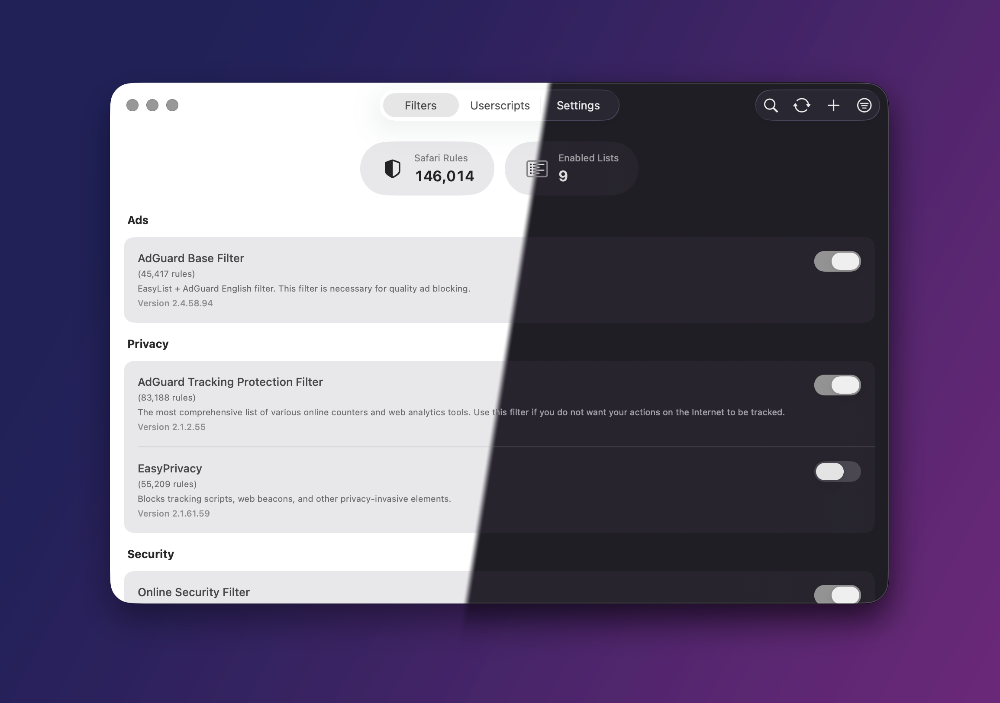
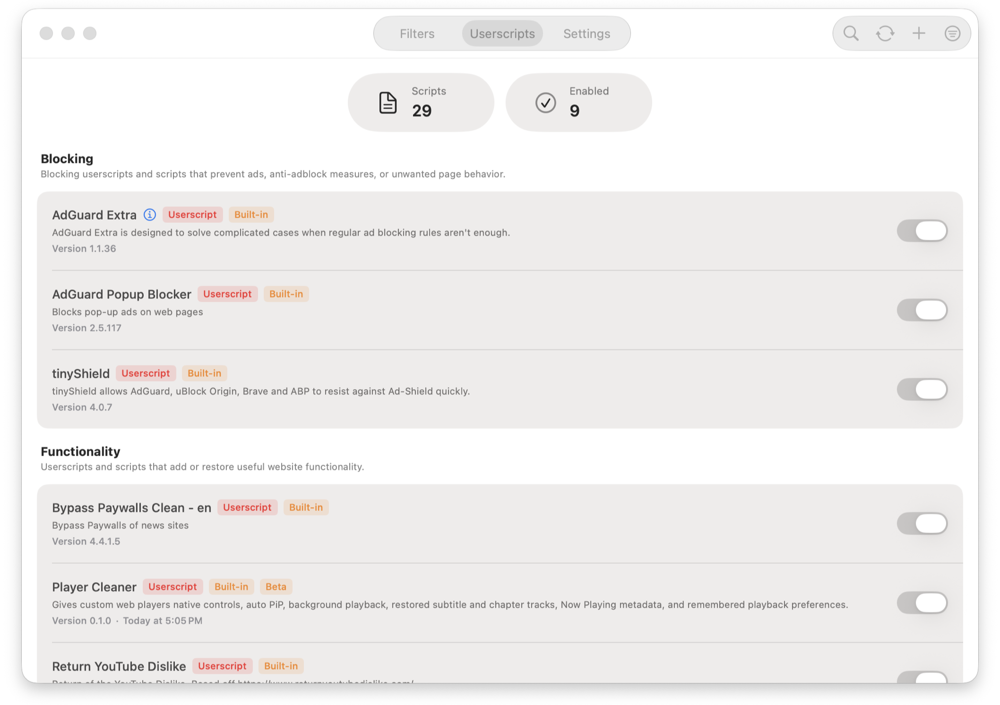
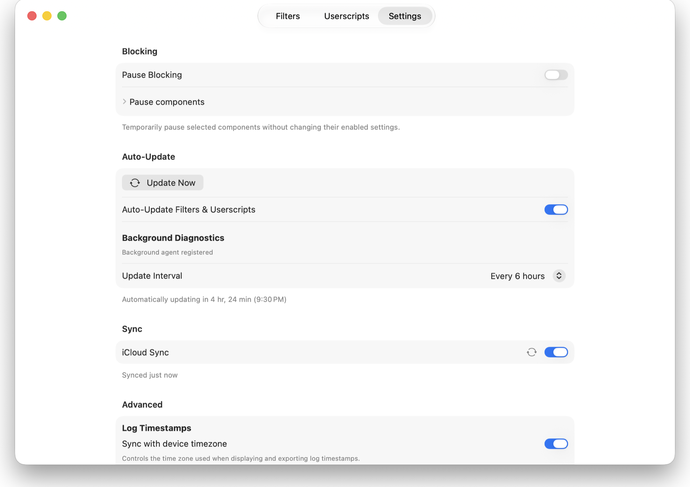
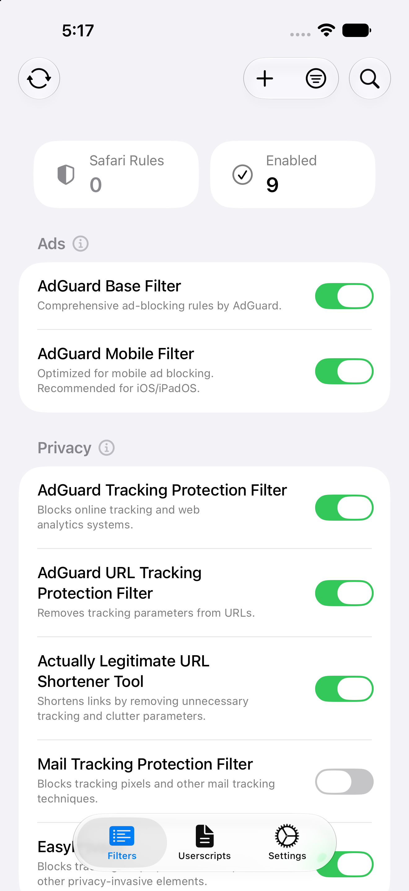
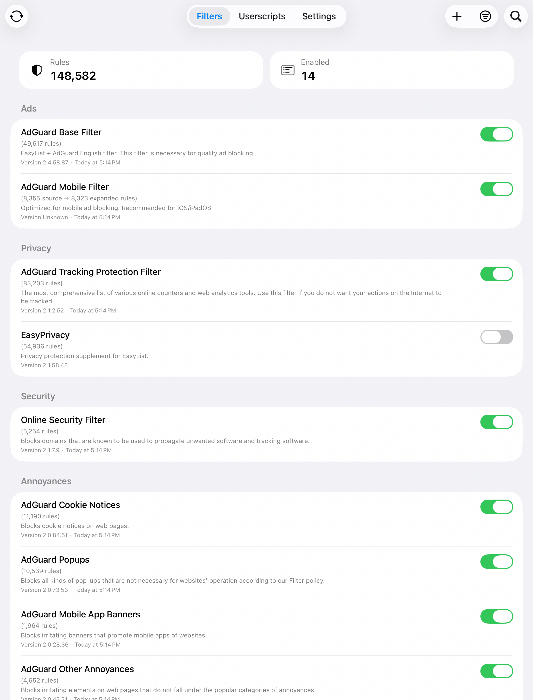
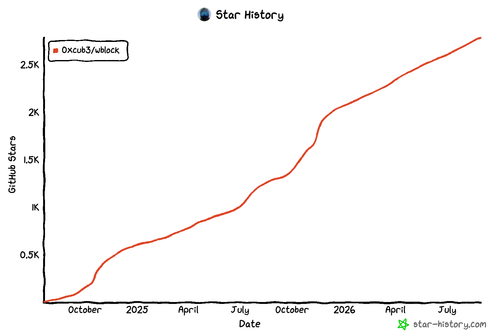

<picture>
  
</picture>

# wBlock

**The end of Safari ad-blocking B.S.**

 

<a href="https://apps.apple.com/us/app/wblock/id6746388723?itscg=30200&itsct=apps_box_badge&mttnsubad=6746388723">
  <picture>
    <source media="(prefers-color-scheme: dark)" srcset="https://toolbox.marketingtools.apple.com/api/v2/badges/download-on-the-app-store/white/en-us?releaseDate=1760313600" width="245" height="82" />
    <source media="(prefers-color-scheme: light)" srcset="https://toolbox.marketingtools.apple.com/api/v2/badges/download-on-the-app-store/black/en-us?releaseDate=1760313600" width="245" height="82" />
    
  </picture>
</a>
    

 
 

 
 

  

 

A Safari content blocker for macOS, iOS, iPadOS, and visionOS. 
750,000 rules across 5 extensions, Protocol Buffer storage, LZ4 compression, and iCloud sync.

 

> [!NOTE]
> **Looking for a detailed comparison?** Check out my [comparison guide](Adblock_Comparison.md) to see how wBlock stacks up against other Safari content blockers.

 

## Features

<table align="center">
<tr>
<td width="50%" valign="top">

### Performance
- **750,000 rule capacity** across 5 Safari content blocking extensions per platform (150k each)
- **~40 MB RAM** at idle — Safari's native content blocking API runs rules out-of-process
- **Protocol Buffers + LZ4** for filter storage; streaming I/O keeps memory low during compilation
- **HTTP conditional requests** (If-Modified-Since/ETag) so updates only download what changed
- **iCloud sync** for filter selections, custom lists, userscripts, and whitelist across devices

### Content modification
- **Element Zapper** (macOS, iOS, iPadOS, visionOS) — visually select and hide page elements in Safari
- **No Autoplay** (macOS, iOS, iPadOS, visionOS) — keeps videos and audio paused until you tap or click them, stopping muted feed/scroll autoplay; enable it globally from the Safari toolbar popup and allow autoplay per site when a page needs it
- **Tube Cleaner & Player Cleaner** — optional remote userscript defaults downloaded from the wBlock-userscripts repository; they turn existing media elements into native Safari players before first paint, restoring Picture-in-Picture and background playback. They update independently of the app version; wBlock's content-blocking rules handle ads separately
- **Userscript engine** with Greasemonkey API (GM_getValue, GM_setValue, GM_xmlhttpRequest)
- **Userstyle support** — install UserCSS themes (.user.css) applied natively as CSS, no JS wrapper needed
- **Custom filter lists** via URL, paste, or file import — supports any AdGuard-syntax blocklist
- **Toolbar search** for quickly finding filters and userscripts
- **Automatic rule distribution** across all 5 content blocker slots for maximum coverage

</td>
<td width="50%" valign="top">

### Blocking
- **Network request blocking** — ads, trackers, cookie banners, annoyances
- **CSS injection** for cosmetic filtering and element hiding
- **Script blocking** for unwanted JavaScript
- **Pop-up and redirect prevention**
- **URL tracking-parameter stripping** — removes UTM and other tracking params, unwraps shortener/redirect URLs (enabled by default via wBlock Scripts)

### Configuration
- **Auto-updates** from every hour to every 7 days, or manual. macOS can keep checking through a bundled launch agent and background update service, iOS background checks are best-effort
- **Per-site controls** — disable blocking on specific sites from the Safari toolbar
- **Blocked request logger** (macOS) — see what's being blocked on each page
- **Per-site settings** — whitelist trusted domains, toggle userscripts per site, and switch element zapper rules on or off per domain
- **Regional filters** with auto-detection based on your locale
- **Homebrew cask** for macOS: `brew tap 0xcub3/wblock && brew install --cask wblock`

</td>
</tr>
</table>

 

---

 

## Screenshots

 

<table>
<tr>
<td align="center">
  <picture>
    <source media="(prefers-color-scheme: dark)" srcset="docs/media/img/userscripts_macos_dark.png" width="700" />
    <source media="(prefers-color-scheme: light)" srcset="docs/media/img/userscripts_macos_light.png" width="700" />
    
  </picture>
 
<strong>Userscript Management</strong> 
<em>Manage paywalls, YouTube Dislikes, and more</em>
  
</td>
</tr>
<tr>
<td align="center">
  <picture>
    <source media="(prefers-color-scheme: dark)" srcset="docs/media/img/settings_macos_dark.png" width="700" />
    <source media="(prefers-color-scheme: light)" srcset="docs/media/img/settings_macos_light.png" width="700" />
    
  </picture>
 
<strong>Settings & Customization</strong> 
<em>Configure auto-updates, notifications, and preferences</em>
  
</td>
</tr>
<tr>
<td align="center">
  <picture>
    <source media="(prefers-color-scheme: dark)" srcset="docs/media/img/filters_ios_dark.png" width="350" />
    <source media="(prefers-color-scheme: light)" srcset="docs/media/img/filters_ios_light.png" width="350" />
    
  </picture>
  
<strong>iOS Interface</strong> 
<em>Full-featured blocking on iPhone</em>
  
</td>
</tr>
<tr>
<td align="center">
  <picture>
    <source media="(prefers-color-scheme: dark)" srcset="docs/media/img/filters_ipados_dark.png" width="700" />
    <source media="(prefers-color-scheme: light)" srcset="docs/media/img/filters_ipados_light.png" width="700" />
    
  </picture>
  
<strong>iPadOS Interface</strong> 
<em>Full-featured blocking on iPad</em>
  
</td>
</tr>
</table>

 

---

 

## Technical Implementation

<table>
<tr>
<td width="50%" valign="top">

**Core Architecture**
- Protocol Buffers (libprotobuf) with LZ4 compression for filter serialization
- Asynchronous I/O with Swift concurrency (async/await, Task, Actor isolation)
- Streaming serialization to disk minimizes peak memory usage during compilation
- 5 Safari content blocking extensions per platform (maximum Safari API capacity)
- SafariServices framework integration for declarative content blocking

</td>
<td width="50%" valign="top">

**Dependencies & Standards**
- SafariConverterLib v4.3.0 for AdGuard to Safari rule conversion
- Bundled AdGuard scriptlet engine for advanced blocking techniques
- Swift concurrency (async/await, Task, Actor isolation) with project-level Swift 5 settings
- VoiceOver and Dynamic Type support throughout the SwiftUI app
- SwiftProtobuf for cross-platform filter storage format

</td>
</tr>
</table>

---

 

## Support Development

wBlock is free and open source. 
If you want to support the project:

 

 

---

 

## FAQ

<b>How does wBlock compare to other ad blockers?</b>

 
Check out our <a href="Adblock_Comparison.md">comparison guide</a> vs uBlock Origin Lite, Wipr 2, and AdGuard's Safari apps.

<b>Should I install wBlock from the App Store or the DMG/Homebrew release?</b>

 
The App Store version is usually preferred because it handles app updates automatically. The DMG/Homebrew release has the same features and is available for users who prefer installing outside the App Store.

<b>Should I use wBlock alongside another ad blocker?</b>

 

<b>No. Use one general-purpose content blocker at a time.</b>

There is no controlled study proving that every possible combination of ad blockers harms every page. However, browser architecture and extension documentation support avoiding overlapping blockers:

- <b>Extensions can make conflicting changes.</b> Mozilla documents that when two extensions attempt conflicting modifications to the same response header, only one change may succeed. Multiple blockers can therefore produce order-dependent behavior rather than a predictable combination of their protections. See <a href="https://developer.mozilla.org/en-US/docs/Mozilla/Add-ons/WebExtensions/API/webRequest/onHeadersReceived">Mozilla’s webRequest documentation</a>.

- <b>Request interception has measurable computational costs.</b> Chromium describes serialization, inter-process communication, persistent-process, and extension-response processing costs associated with blocking request handlers. Running redundant filtering systems duplicates at least some rule evaluation and page-processing work. See <a href="https://blog.chromium.org/2019/06/web-request-and-declarative-net-request.html">Chromium’s explanation of Web Request and Declarative Net Request</a> and <a href="https://developer.chrome.com/docs/extensions/develop/migrate/what-is-mv3">Chrome’s Manifest V3 overview</a>.

- <b>Major blocker maintainers explicitly advise against stacking.</b> The official uBlock Origin README states: “Do NOT use uBO with any other content blocker.” It explains that another blocker can prevent uBO’s privacy or anti-blocker-defusing features from working correctly. See <a href="https://github.com/gorhill/ublock#all-programs">uBlock Origin’s official documentation</a>.

- <b>Documented failure modes include slower loading and broken functionality.</b> AdGuard warns that two blockers may compete over the same requests, causing slower page loading, broken websites, or video-playback problems. See <a href="https://adguard.com/en/adguard-browser-extension/opera/overview.html">AdGuard’s guidance</a>.

For wBlock specifically, another blocker also makes troubleshooting impossible as well. When an advertisement survives or a site breaks, either blocker’s network rules, cosmetic rules, scriptlets, exceptions, or execution order may be responsible. The second blocker is therefore a confounding variable. Disable all other content blockers before reporting a wBlock issue.

 

Installing redundant blockers is not defense in depth when both tools compete at the same interception layer. It is an uncontrolled experiment with no control group.

<b>Can I use my own filter lists?</b>

 
Yes. You can add any AdGuard-compatible filter list by URL, paste rules directly, or import from a file.

<b>Should I enable more filter lists for better blocking?</b>

 
Usually not. The recommended defaults already cover most ads and trackers, and most other general-purpose lists overlap with them. Enabling more mainly uses up Safari's rule limit and increases the chance of site breakage. The exceptions are Annoyances filters (cookie banners, popups, social widgets) and regional filters for non-English sites, which cover things the defaults do not.

<b>Does wBlock slow down Safari?</b>

 
No in normal use. wBlock uses Safari's native declarative content blocking API, which applies compiled rules outside the app process. Local idle checks sit around ~40 MB, and page loading stays on Safari's native blocker path.

<b>Do userscripts work on iOS and iPadOS?</b>

 
Yes. The userscript engine implements common Greasemonkey APIs (GM_getValue, GM_setValue, GM_xmlhttpRequest, GM_addStyle) on iOS, iPadOS, and macOS via Safari Web Extensions.

<b>How do I block Twitch ads?</b>

 
wBlock bundles the <b>AdGuard Extra</b> userscript, which can help with Twitch ads by talking to Twitch's GraphQL API (gql.twitch.tv) — the same general approach uBlock Origin users rely on. It ships <b>disabled by default</b>, so enable it for Twitch:
  
1. Open wBlock and go to the <i>Userscripts</i> section. 
2. Find <b>AdGuard Extra</b> in the built-in list and toggle it on. 
3. Reload any open Twitch tabs.
  
This is best-effort, community-style ad blocking: Twitch frequently changes how ads are served, so it may occasionally break until the userscript is updated. There is no guarantee every ad is removed.

<b>What are Tube Cleaner and Player Cleaner?</b>

 
They are optional remotely downloaded userscripts, inspired by Vinegar and Baking Soda, that expose Safari's native controls on a site's existing media element. They are disabled by default; enable them in the <i>Userscripts</i> section. Their releases are hosted in <a href="https://github.com/0xCUB3/wBlock-userscripts">wBlock-userscripts</a> and are not tied to a wBlock app version.
  
<b>Tube Cleaner</b> targets YouTube watch, Shorts, and Music pages. It leaves <code>/embed</code> and youtube-nocookie frames to YouTube's own player so those iframes do not go blank. On watch pages it lets YouTube create and initialize its own <code>&lt;video&gt;</code> and SABR/MSE stream, then applies native controls and hides YouTube's custom chrome before it can paint. Hover-to-play thumbnail previews stay with YouTube so they cannot steal the watch player. Reusing the same media element preserves buffering and adaptive playback while restoring Picture-in-Picture and background playback. It mirrors YouTube chapters and subtitles into Safari's native media menus and skips known segments through <a href="https://sponsor.ajay.app/">SponsorBlock</a>'s privacy-preserving hash-prefix API. Its compact SB panel provides SponsorBlock-style category colors and per-category Auto skip, Show skip button, or Disabled behavior, plus minimum-duration, Undo-notice, current-video, and channel-exclusion controls. An opt-in DA panel can use <a href="https://dearrow.ajay.app/">DeArrow</a> to replace submitted titles and thumbnails on the watch page and visible YouTube cards, restore originals on hover, or exclude the current channel. Results are session-cached; random fallback thumbnails, title reformatting, submissions, and voting remain features of the full DeArrow extension. SponsorBlock and DeArrow API data are used under <a href="https://creativecommons.org/licenses/by-nc-sa/4.0/">CC BY-NC-SA 4.0</a>. SB and DA sit on their own toolbar row below the quality and audio/video controls. On iPhone and iPad, Safari's native controls own playback while the compact toolbar appears above them; mobile quality choices apply only to the current video so a fixed range cannot stall the next ManagedMediaSource stream. Tube Cleaner also preserves the remote-playback restriction WebKit requires for that stream, while audio-only remains a macOS feature. It follows the active player as YouTube retains offscreen Shorts. Ads remain the responsibility of wBlock's content-blocking rules.
  
<b>Player Cleaner</b> targets custom players on other websites (video.js, JW Player, Plyr, Flowplayer, MediaElement, Clappr, Media Chrome/Mux, and more), including shadow-root players such as Archive.org's <code>&lt;play-av&gt;</code>. It enables native controls immediately. When a safe direct source is available in the light DOM, it removes the custom chrome while retaining the original media element; shadow components and opaque HLS/DASH/MSE pipelines remain intact and continue using the site's stream machinery. It recovers subtitle and chapter sidecars exposed by the page or common player APIs, fills missing system Now Playing metadata and media-key actions, and remembers playback speed, volume, mute state, subtitle language, and resume position per site. If a site misbehaves, disable Player Cleaner for that site from the wBlock toolbar.

<b>Where do I find them, and what can I test them on?</b>

 
Both ship disabled. Open the <i>Userscripts</i> tab: <i>Tube Cleaner</i> and <i>Player Cleaner</i> sit at the top of the <i>General</i> section. Switch one on, then reload the page you want to test. If they are not in the list, you are running a wBlock build from before this change — quit wBlock and run this branch from Xcode (a Homebrew or release install cannot contain branch code).
  
Tube Cleaner (YouTube watch pages):
 • <a href="https://www.youtube.com/watch?v=aqz-KE-bpKQ">Big Buck Bunny</a> — long, many qualities, good for the quality menu
 • <a href="https://www.youtube.com/watch?v=eRsGyueVLvQ">Sintel</a>
 • <a href="https://www.youtube.com/watch?v=R6MlUcmOul8">Tears of Steel</a>
 Check that native controls appear without a flash of YouTube chrome, that the quality and audio-only controls work, that the toolbar reappears when you move the mouse over an already-hovered player, that Picture-in-Picture works, and that audio keeps playing in another tab. Embedded YouTube iframes on other sites should keep YouTube's own player. The DA panel is off by default; enable it to test DeArrow titles, thumbnails, original-on-hover behavior, and channel exclusions. Ad behavior depends on the enabled wBlock filter lists.
  
Player Cleaner (other sites' custom players), one demo per supported library:
 • video.js / Media Chrome — <a href="https://videojs.org/">videojs.org</a>
 • Plyr — <a href="https://plyr.io/">plyr.io</a>
 • JW Player — <a href="https://developer-tools.jwplayer.com/stream-tester">stream tester</a> and <a href="https://jwplayer.github.io/jwplayer/">demo</a>
 • Archive.org shadow-root JW Player — <a href="https://archive.org/details/gov.ntis.ava15996vnb1/0.theater.hd.splice.avi">FedFlix sample</a>
 • Clappr — <a href="http://clappr.io/">clappr.io</a> and <a href="http://cdn.clappr.io/">cdn.clappr.io</a>
 • MediaElement — <a href="https://www.mediaelementjs.com/">mediaelementjs.com</a>
 • hls.js — <a href="https://hlsjs.video-dev.org/demo/">hls.js demo</a>
 • dash.js — <a href="https://reference.dashif.org/dash.js/latest/samples/dash-if-reference-player/index.html">DASH reference player</a>
 Check that native controls appear promptly, Picture-in-Picture and fullscreen work, and playback does not restart when the custom chrome disappears. HLS/DASH/blob players may retain their stream pipeline while using native controls. If a site misbehaves, disable Player Cleaner for that site from the wBlock toolbar.

<b>Why don't cookie banners or scriptlets work in Private Browsing?</b>

 
Safari keeps Web Extensions off in Private Browsing until you enable <i>Allow in Private Browsing</i> for each one. Cookie-notice filters often dismiss banners with scriptlets (for example heise.de via Sourcepoint), and those only run through wBlock Scripts.
  
Safari → Settings → Extensions → enable <i>Allow in Private Browsing</i> for wBlock Scripts and all 5 wBlock content blockers, then reload the Private window.
  
If a banner is already gone in a normal window, that can just be a stored consent cookie. Clear that site's cookies and compare again before assuming the filter is broken only in Private Browsing.

<b>How often do filters update?</b>

 
Auto-update intervals are configurable from 1 hour to 7 days, or manually triggered. On macOS, enabling auto-update registers a bundled launch agent that can keep checking while the app is closed through a background update service. On iOS and iPadOS, background checks are best-effort and may wait until the system wakes wBlock or you reopen it. Opening Safari does not trigger updates. Updates use HTTP conditional requests (If-Modified-Since/ETag headers) when servers support them, which reduces unnecessary downloads.

<b>Is the element zapper available on iOS and iPadOS?</b>

 
Yes. Open the wBlock extension popup in Safari and tap <i>Activate Element Zapper</i>.

 

---

 

### Credits

**[@arjpar](https://github.com/arjpar)** · **[@ameshkov](https://github.com/ameshkov/safari-blocker)** · **[@shindgew](https://github.com/shindgew)**

 

 

Developed by [0xCUB3](https://github.com/0xCUB3)

 

---

 

<a href="https://www.star-history.com/?repos=0xCUB3%2FwBlock&type=date&legend=top-left">
 <picture>
   <source media="(prefers-color-scheme: dark)" srcset="docs/media/img/star_history_dark.png" />
   <source media="(prefers-color-scheme: light)" srcset="docs/media/img/star_history_light.png" />
   
 </picture>
</a>

